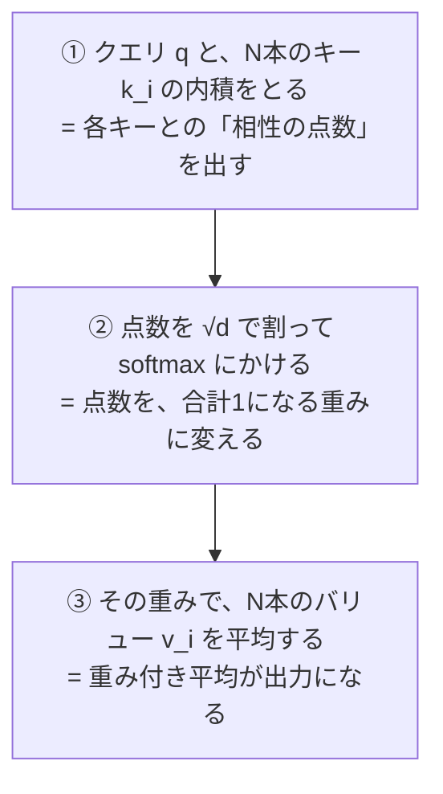

この記事を読むと、Transformerの `softmax(QKᵀ/√d)V` が「連想記憶から記憶を思い出す計算」と**一字一句同じ式**であることを、自分の手で確かめられます。GPUは不要で、前半はnumpyだけ、後半も150Mパラメータの小さなモデルをCPUで動かすだけです。

Attentionの実装を読んだことがある人なら、あの `/ math.sqrt(d_k)` が気になったことがあるはずです。なぜ割るのか。なぜ `d` ではなく `√d` なのか。「スケーリングのため」と書かれているのを読んで、わかったようなわからないような気持ちになったまま先へ進んだ人は多いと思います。

この記事の結論を先に言うと、**あの `√d` は温度です**。しかも比喩ではなく、[前回の記事](https://zenn.dev/m2yagyu/articles/llm-temperature-boltzmann)で扱った統計力学の温度と同じものです。そしてその温度が支配しているのは、Attentionが「記憶をひとつだけ思い出すか、複数を混ぜて思い出すか」という切り替えでした。

## そもそもAttentionは何を計算しているのか？

まず式を確認します。よく見る形はこれです。

$$
\mathrm{Attention}(Q,K,V) = \mathrm{softmax}\!\left(\frac{QK^\top}{\sqrt{d}}\right)V
$$

記号が多いので、いったん1つのクエリだけに絞ります。クエリ $q$ が1本、キーとバリューが $N$ 本ずつあるとすると、やっていることは3ステップです。



つまりAttentionは**「問い合わせに近いものほど重く数える、重み付き平均」**です。ここまでは実装を読めばわかる話です。

問題は、この計算に名前がついていることに気づきにくい点です。「手がかりを渡すと、それに近いものを引っ張り出してくる」という装置は、機械学習より40年前から物理の世界にありました。**連想記憶**です。

## 「思い出す」という計算を、先に書いてみる

Attentionのことはいったん忘れて、連想記憶をゼロから作ってみます。やりたいことはこうです。

- いくつかのパターン（記憶）を保存しておく
- 一部が欠けたり、ノイズで崩れたパターン（手がかり）を渡す
- 元の完全なパターンを返してもらう

人間でいえば「ぼんやりした思い出しかけの記憶から、元の出来事を思い出す」に当たります。

素直に書くとこうなります。記憶を並べた行列 $X$（1列が1つの記憶）と、手がかり $\xi$ を用意して、**「手がかりと似ている記憶ほど重く数えて、記憶たちを平均する」**だけです。

```python
import numpy as np

def softmax(z):
    z = z - z.max()
    return np.exp(z) / np.exp(z).sum()

def make_cue(x, sigma, rng):
    """記憶 x に、x の大きさに対して相対的に sigma 倍のノイズを乗せた手がかりを作る"""
    n = rng.normal(size=x.shape)
    n /= np.linalg.norm(n)
    c = x + sigma * n
    return c / np.linalg.norm(c)

rng = np.random.default_rng(0)
d, N = 64, 6                                    # 特徴の次元 / 記憶の数
X = rng.normal(size=(d, N))
X /= np.linalg.norm(X, axis=0, keepdims=True)   # 記憶を単位ノルムに揃える

target = 3
xi = make_cue(X[:, target], 0.5, rng)           # 記憶3を半分の大きさのノイズで崩す

beta = 100.0                                     # 逆温度。あとで意味を説明します
w = softmax(beta * (X.T @ xi))                   # ① 各記憶との相性 → ② 重みに変換
recalled = X @ w                                 # ③ 重み付き平均

print("選ばれた記憶:", w.argmax(), " 重み:", w.max().round(3))
print("元の記憶との差:", np.abs(recalled - X[:, target]).max().round(4))
```

実行するとこうなります。

```
選ばれた記憶: 3  重み: 1.0
元の記憶との差: 0.0
```

崩れた手がかりから、元の記憶3が完全に戻ってきました。


②の手がかり（灰色）は、元の記憶（青）からかなり崩れています。それでも③で記憶3だけに重みが集まり、④で元の波形がぴったり戻っています。

### なぜこれが「記憶」だと言えるのか？

やっているのは内積とsoftmaxと行列積だけで、どこにも「検索」や「照合」のような手続きは書いていません。それでも想起が成立するのは、**高次元ではランダムな2本のベクトルがほぼ直交する**からです。

$d=64$ 次元でランダムに引いた記憶どうしの内積はほぼ0になり、自分自身との内積だけが1になります。手がかりが記憶3の近くにあれば、記憶3との内積だけが突出し、softmaxがそれを1に、他を0に押し上げます。次元が高いほど記憶どうしが干渉しにくくなる、というのがこの仕組みの土台です。

## なぜその式がAttentionと一致するのか？

さて、いま書いた想起の式はこれでした。

$$
\xi_{\text{new}} = X \,\mathrm{softmax}(\beta X^\top \xi)
$$

そしてAttentionはこれでした。

$$
\mathrm{Attention}(q,K,V) = \mathrm{softmax}\!\left(\frac{qK^\top}{\sqrt{d}}\right)V
$$

対応をとってみます。

| 連想記憶 | Attention |
|---|---|
| 手がかり $\xi$ | クエリ $Q$ |
| 保存された記憶 $X$ | キー $K$ |
| 取り出す中身 $X$ | バリュー $V$ |
| 逆温度 $\beta$ | $1/\sqrt{d}$ |

$K$ と $V$ に同じ記憶行列を入れ、$\beta = 1/\sqrt{d}$ と置けば、2つの式は同じものになります。実際に確かめます。

```python
rng = np.random.default_rng(1)
M = rng.normal(size=(64, 8))          # 記憶を並べた行列（1列が1つの記憶）
cue = M[:, 3] + 0.6 * rng.normal(size=64)

# (A) 連想記憶の想起則
beta = 1.0 / np.sqrt(64)
recalled = M @ softmax(beta * (M.T @ cue))

# (B) Transformerのattention（K=V=記憶パターン, Q=手がかり）
def softmax_rows(z):
    z = z - z.max(axis=-1, keepdims=True)
    return np.exp(z) / np.exp(z).sum(axis=-1, keepdims=True)

Q, K, V = cue[None, :], M.T, M.T
out = softmax_rows(Q @ K.T / np.sqrt(64)) @ V

print("最大絶対誤差:", np.abs(recalled - out[0]).max())
print("一致:", np.allclose(recalled, out[0]))
```

```
最大絶対誤差: 0.0
一致: True
```

誤差は $10^{-16}$ 程度ではなく、**ちょうど0**です。近似的に似ているのではなく、同じ順序で同じ演算をしているので当然そうなります。

これは後付けの解釈ではありません。Ramsauerらの論文 [Hopfield Networks is All You Need](https://arxiv.org/abs/2008.02217)（ICLR 2021）が、現代版Hopfieldネットワークの想起則を導出したうえで「これはTransformerのattentionそのものである」と示しています。タイトルが元論文 [Attention Is All You Need](https://arxiv.org/abs/1706.03762) のもじりになっているのはそのためです。

つまり**Transformerの各ヘッドは、毎回「その文脈の中から記憶をひとつ思い出す」という計算を実行している**ことになります。

## なぜ √d で割る必要があるのか？

ここからが本題です。$\beta = 1/\sqrt{d}$ という対応が出てきましたが、なぜこの値なのでしょうか。

直感的な説明から入ります。softmaxに渡す点数が大きすぎると、1位だけが1になって他が全部0になります。逆に点数が小さすぎると、全部が同じくらいの重みになって「平均しただけ」になります。**点数の大きさは、softmaxがどれくらい鋭く効くかを決めるつまみ**です。

ここで問題になるのが、内積の大きさが次元 $d$ に依存することです。成分がそれぞれ分散1の $q, k$ について、内積 $q \cdot k = \sum_{i=1}^{d} q_i k_i$ は $d$ 個の項の和なので、その分散は $d$ に比例します。つまり標準偏差は $\sqrt{d}$ に比例して育ちます。

$d$ を大きくすると点数が勝手に大きくなり、softmaxが勝手に鋭くなってしまう。これを打ち消すのが $\sqrt{d}$ で割る操作です。実際に測ります。

```python
rng = np.random.default_rng(2)

for dd in [16, 64, 256, 1024, 4096]:
    # 内積そのものの散らばり
    q = rng.normal(size=(3000, dd))
    k = rng.normal(size=(3000, dd))
    std = (q * k).sum(1).std()

    # 16本のキーに対する注意重みの最大値。1回だと振れるので200回の平均をとる
    with_sqrt, without_sqrt = [], []
    for _ in range(200):
        K = rng.normal(size=(16, dd))
        sc = K @ rng.normal(size=dd)
        with_sqrt.append(softmax(sc / np.sqrt(dd)).max())
        without_sqrt.append(softmax(sc).max())

    print(f"d={dd:5d}  内積の標準偏差={std:7.1f}  "
          f"最大重み(÷√d有)={np.mean(with_sqrt):.3f}  "
          f"(÷√d無)={np.mean(without_sqrt):.3f}")
```

```
d=   16  内積の標準偏差=    4.0  最大重み(÷√d有)=0.240  (÷√d無)=0.671
d=   64  内積の標準偏差=    8.0  最大重み(÷√d有)=0.245  (÷√d無)=0.824
d=  256  内積の標準偏差=   15.8  最大重み(÷√d有)=0.247  (÷√d無)=0.916
d= 1024  内積の標準偏差=   32.0  最大重み(÷√d有)=0.235  (÷√d無)=0.940
d= 4096  内積の標準偏差=   63.6  最大重み(÷√d有)=0.248  (÷√d無)=0.978
```


内積の標準偏差は 4.0 → 63.6 と、ちょうど $\sqrt{d}$ に比例して育っています（$d$ が256倍で標準偏差は16倍）。

そして $\sqrt{d}$ で割らない場合、最大の注意重みは 0.671 → 0.978 と上がり続けます。16本のキーがあるのに、$d=4096$ では実質1本しか見ていません。**しかもこれは学習の結果ではなく、次元を上げただけで自動的にそうなります。**

一方 $\sqrt{d}$ で割ると、$d$ を256倍にしても最大重みは 0.240 → 0.248 とほぼ動きません（均等に見た場合が $1/16 = 0.0625$ なので、適度に絞れている状態です）。**次元をいくら変えても同じ鋭さが保たれる**わけです。

### √d は温度を次元によらず一定に保つ係数だった

いま起きたことを物理の言葉に翻訳します。softmaxの中身を

$$
\mathrm{softmax}(\beta s_i) = \frac{e^{\beta s_i}}{\sum_j e^{\beta s_j}}
$$

と書くと、これは[前回の記事](https://zenn.dev/m2yagyu/articles/llm-temperature-boltzmann)で扱ったボルツマン分布そのものです。$\beta = 1/T$ が逆温度、$-s_i$ がエネルギーに当たります。

$\sqrt{d}$ で割らない場合、実効的な温度は $T \propto 1/\sqrt{d}$ となり、次元を上げるほど温度が下がります。**次元を上げただけで系が絶対零度に向かって凍りつく**わけです。凍りついた系は1つの状態しか取らないので、softmaxの出力は完全なone-hotになり、勾配はほぼ消えます。

$\sqrt{d}$ で割るというのは、**次元をいくら変えても温度が一定に保たれるように正規化する操作**でした。「スケーリングのため」という説明は正しいのですが、何をスケーリングしているかというと、温度です。

## 温度を変えると、記憶の想起はどう変わるか？

温度だとわかったので、振ってみます。$\beta$ を変えながら想起の重みを見ます。

```python
def eff(w):
    """有効記憶数 exp(H)。1なら1つの記憶に絞れている"""
    w = np.clip(w, 1e-30, 1)
    return np.exp(-(w * np.log(w)).sum())

for b in [0.5, 2, 4, 8]:
    w = softmax(b * (X.T @ xi))
    print(f"β={b:4.1f} (T={1/b:.2f})  最大重み={w.max():.3f}  有効記憶数={eff(w):.2f}")
```

```
β= 0.5 (T=2.00)  最大重み=0.242  有効記憶数=5.88
β= 2.0 (T=0.50)  最大重み=0.556  有効記憶数=4.00
β= 4.0 (T=0.25)  最大重み=0.880  有効記憶数=1.72
β= 8.0 (T=0.12)  最大重み=0.995  有効記憶数=1.04
```


「有効記憶数」は $\exp(H)$、つまりエントロピーの指数です。前回perplexityとして出てきたものと同じ量で、**実効的に何個の記憶を混ぜているか**を表します。記憶が6個なので、6なら全部を均等に混ぜた状態、1なら1個に絞れた状態です。

$\beta$ を上げていくと 5.88 → 4.00 → 1.72 → 1.04 と落ちていきます。連続的に見るとこうなります。


高温では全部の記憶がぼんやり混ざり、低温では1つの記憶がくっきり立ち上がる。前回「温度を下げると1位のトークンに確率が集中する」という現象を見ましたが、まったく同じことが記憶の想起でも起きています。**同じ式なので当たり前ですが、その当たり前が面白いところです。**

これは実務上の意味も持ちます。Attentionのヘッドが「1つのトークンを鋭く参照する」のか「文脈全体をならして見る」のかは、学習で決まる別々の機能のように見えて、**実体は同じ式のスコアの大きさ、つまり実効温度の違い**でしかありません。

## 何個まで記憶を詰め込めるのか？

連想記憶には容量の限界があります。詰め込みすぎると記憶どうしが干渉して、手がかりを渡しても正しいものが出てこなくなります。

古典的なHopfieldネットワーク（1982年）の容量は、スピングラスの理論から $0.138 \times d$ 個と計算されています。$d=64$ なら**8.8個**しか覚えられません。えらく少ないと感じますが、これがsoftmax版だとどうなるか測ってみます。手がかりには記憶の2倍の大きさのノイズを乗せる、かなり厳しい条件にします。

```python
rng = np.random.default_rng(4)

d = 64
for N in [8, 32, 128, 512, 2048, 8192]:
    ok = 0
    for _ in range(400):
        Xc = rng.normal(size=(d, N))
        Xc /= np.linalg.norm(Xc, axis=0, keepdims=True)
        t = rng.integers(N)
        cue = make_cue(Xc[:, t], 2.0, rng)
        ok += int(softmax(100.0 * (Xc.T @ cue)).argmax() == t)
    print(f"N={N:5d}  正解率 {ok/400*100:5.1f}%  (でたらめなら {100/N:.3f}%)")
```

```
N=    8  正解率  99.5%  (でたらめなら 12.500%)
N=   32  正解率  94.8%  (でたらめなら 3.125%)
N=  128  正解率  87.0%  (でたらめなら 0.781%)
N=  512  正解率  78.0%  (でたらめなら 0.195%)
N= 2048  正解率  61.8%  (でたらめなら 0.049%)
N= 8192  正解率  50.0%  (でたらめなら 0.012%)
```


$d=64$ のまま、**8192個**の記憶から正しいものを50.0%で取り出せています。でたらめに選んだ場合の0.012%と比べると4000倍以上です。古典の限界8.8個とは桁が違います。

この差が生まれるのは、softmaxの指数関数が効いているからです。古典Hopfieldは内積を線形に足し合わせるので干渉がそのまま蓄積しますが、softmaxは1位とのわずかな差を指数的に増幅するため、干渉を押しつぶせます。Ramsauerらはこの容量が $d$ に対して指数的に増えることを示しています。

Transformerが長い文脈から必要な1語を引っ張ってこられるのは、この容量に支えられています。

## 本物のTransformerでもそうなっているのか？

ここまでは自作の連想記憶の話でした。実物のLLMのattentionが本当にこう振る舞っているかを測ります。モデルは前回と同じ `llm-jp/llm-jp-3-150m`（150Mパラメータ、12層×8ヘッド、ヘッドあたり $d=64$）で、CPUで動きます。

```python
import torch
from transformers import AutoTokenizer, AutoModelForCausalLM

MODEL = "llm-jp/llm-jp-3-150m"
tok = AutoTokenizer.from_pretrained(MODEL)
model = AutoModelForCausalLM.from_pretrained(
    MODEL, attn_implementation="eager", dtype=torch.float32)  # 重みを見るのでeager
model.eval()

text = "日本の首都は東京です。日本で一番高い山は富士山です。日本の首都は"
ids = tok(text, return_tensors="pt")
with torch.no_grad():
    out = model(**ids, output_attentions=True)

# 最終トークンが、どのトークンをどれだけ見ているか
E = []
for l, a in enumerate(out.attentions):
    w = a[0, :, -1, :].float().numpy()      # (ヘッド, トークン)
    for h in range(w.shape[0]):
        E.append((eff(w[h]), l, h))
E.sort()
print(f"有効注目数: 最小 {E[0][0]:.2f} / 中央値 {np.median([e[0] for e in E]):.2f} "
      f"/ 最大 {E[-1][0]:.2f}  (全17トークン)")
```

```
有効注目数: 最小 1.04 / 中央値 5.61 / 最大 12.43  (全17トークン)
```


96個のヘッドが、1.04（1語だけを鋭く見る）から12.43（17語中12語をならして見る）まで幅広く分布しています。**すべて同じ式・同じ $\sqrt{d}$ を使っているのに、実効的な温度がヘッドごとに違う**わけです。温度を決めているのは $\sqrt{d}$ ではなく、学習で決まった $W_Q, W_K$ が作るスコアの大きさです。

$\sqrt{d}$ は温度の基準点を揃えるだけで、そこからどれだけ上下させるかはモデルが学習で決めている、という分業になっています。実際、$\sqrt{d}$ で割る前のスコアの大きさを層ごとに測ると違います。

```python
with torch.no_grad():
    hs = model(**ids, output_hidden_states=True).hidden_states

T, d_head = ids["input_ids"].shape[1], 64
for layer in [0, 6, 11]:
    blk = model.model.layers[layer].self_attn
    with torch.no_grad():
        # q_proj/k_proj には input_layernorm を通した後の値が入る。
        # 生の hidden_states を渡すとスケールが違い、誤った分散になる
        x = model.model.layers[layer].input_layernorm(hs[layer])
        q = blk.q_proj(x)[0].view(T, -1, d_head).transpose(0, 1)
        k = blk.k_proj(x)[0].view(T, -1, d_head).transpose(0, 1)
        s = torch.matmul(q, k.transpose(-1, -2))
    print(f"第{layer:>2}層: 割る前 {s.std().item():6.2f} → "
          f"√d(8)で割った後 {(s / np.sqrt(d_head)).std().item():5.2f}")
```

```
第 0層: 割る前  27.73 → √d(8)で割った後  3.47
第 6層: 割る前  29.67 → √d(8)で割った後  3.71
第11層: 割る前  10.14 → √d(8)で割った後  1.27
```

同じ $\sqrt{d}$ で割っていても、割った後の散らばりが第6層で3.71、第11層で1.27と3倍近く違います。**層ごとに実効温度が違う**ということです。

### 最も鋭いヘッドが見ていたのは単語ではなかった

ここで予想外の結果が出ました。最も鋭い（＝最も低温の）ヘッド上位10個が何を見ているかを調べると、**10個中10個が文頭トークン `<s>` を見ていました**。

```
第 9層 ヘッド1  有効注目数1.04  → '<s>'
第 3層 ヘッド0  有効注目数1.15  → '<s>'
第10層 ヘッド4  有効注目数1.33  → '<s>'
...
→ 上位10個のうち 10 個が先頭トークンを見ている
```


第9層ヘッド1は、重みの99.6%を `<s>` に置いています。文頭トークンは内容を持たないので、意味のある想起をしているとは考えにくい。

これは **attention sink** として知られる現象です（[Xiao et al., 2023](https://arxiv.org/abs/2309.17453)）。softmaxは重みの合計を必ず1にするので、「今回は思い出すべきものが何もない」という状況でも、どこかに重みを置かざるを得ません。その捨て場所として、どの文でも必ず存在する先頭トークンが使われます。

連想記憶の言葉でいえば、**手がかりにマッチする記憶が無いときに落ち着く既定の状態**です。物理でいう基底状態に近い役割を、学習の結果としてモデルが自分で用意したことになります。

なお、この記事の実験は17トークンの1文だけで測ったものなので、「このモデルのヘッドの性格」を一般化して語れるものではありません。長い文や別の文で測れば分布は変わります。ここで確かめられるのは「同じ式のまま、ヘッドによって実効温度が大きく違う」という点までです。

## これは物理のどこから来たのか？

最後に出自を確認します。連想記憶をこの形で定式化したのは、物理学者のJohn Hopfieldが1982年に発表した論文です。磁性体のモデル（イジング模型・スピングラス）をそのまま記憶の模型として読み替える、という発想でした。

Hopfieldネットワークにはエネルギー関数があり、記憶はそのエネルギーの**極小点**として保存されます。想起とは、手がかりの位置から坂を下って一番近い谷に落ちることです。

現代版のエネルギー関数はこう書けます。

$$
E(\xi) = -\frac{1}{\beta}\log\sum_{i=1}^{N} e^{\beta\, x_i^\top \xi} + \frac{1}{2}\|\xi\|^2
$$

第1項は log-sum-exp で、統計力学では**自由エネルギー** $-\frac{1}{\beta}\log Z$ そのものです（$Z$ が分配関数）。前回の記事でsoftmaxの分母が分配関数だと確認しましたが、それがここで自由エネルギーとして再登場しています。このエネルギーを $\xi$ で微分して更新式を作ると、先ほどの $X\,\mathrm{softmax}(\beta X^\top\xi)$ が出てきます。

温度によってこの地形がどう変わるかを描くと、話が完結します。


高温（左）では3つの記憶が1つの大きな谷に融けていて、どこから落ちても同じ場所に着きます。区別ができないので、想起は「全部の平均」になります。温度を下げる（右）と谷が3つに分裂し、記憶それぞれが独立した極小点になります。これが「1つの記憶に絞れた」状態の正体です。

さきほど $\beta$ を振って見た有効記憶数 5.88 → 1.04 の変化は、この地形が融合状態から分離状態へ移る様子を数値で見ていたことになります。

ちなみにHopfieldは、この一連の仕事で2024年のノーベル物理学賞をGeoffrey Hintonと共同受賞しています。受賞理由は「人工ニューラルネットワークによる機械学習を可能にした基礎的発見と発明」でした。物理の道具で作られた記憶の模型が、40年後にTransformerの中で毎秒何十億回も実行されている、というのがいまの状況です。

## まとめ

- Attentionの `softmax(QKᵀ/√d)V` は、連想記憶の想起則 $X\,\mathrm{softmax}(\beta X^\top\xi)$ と**同一の式**でした。実際に計算すると誤差はちょうど0です
- $\sqrt{d}$ で割るのは**温度を次元によらず一定に保つ**ためでした。割らないと最大重みが $d$ とともに 0.671 → 0.978 と上がり、16本のキーのうち実質1本しか見なくなります
- $\beta$（逆温度）は、記憶を1つに絞るか複数を混ぜるかを決めるつまみです。前回の記事の温度と同じものが、同じ働きをしています
- 容量は古典Hopfieldの $0.138d \simeq 8.8$ 個をはるかに超え、$d=64$ で8192個の記憶から50.0%で取り出せました
- 実物のLLMでは、96ヘッドの有効注目数が1.04から12.43まで分布していました。$\sqrt{d}$ が基準点を揃え、そこからの上下は学習が決めています
- 最も鋭いヘッドは単語ではなく文頭トークンを見ていました。思い出すものが無いときの重みの捨て場所（attention sink）です

「Attentionは重み付き平均だ」という理解は間違っていませんが、**何の重み付き平均なのか**まで降りると、40年前の磁性体の模型に行き着きます。次回は、この $\beta$ がもう一箇所、思わぬところにも隠れている話を扱う予定です。

## 参考文献

- Vaswani et al., [Attention Is All You Need](https://arxiv.org/abs/1706.03762) (NeurIPS 2017) — $\sqrt{d}$ による正規化の初出
- Ramsauer et al., [Hopfield Networks is All You Need](https://arxiv.org/abs/2008.02217) (ICLR 2021) — 現代版Hopfieldとattentionの同一性、指数的な容量
- J. J. Hopfield, [Neural networks and physical systems with emergent collective computational abilities](https://www.pnas.org/doi/10.1073/pnas.79.8.2554) (PNAS 1982) — 連想記憶の原論文
- Amit, Gutfreund & Sompolinsky, [Storing infinite numbers of patterns in a spin-glass model of neural networks](https://journals.aps.org/prl/abstract/10.1103/PhysRevLett.55.1530) (PRL 1985) — 容量 $0.138N$ の導出
- Xiao et al., [Efficient Streaming Language Models with Attention Sinks](https://arxiv.org/abs/2309.17453) (ICLR 2024) — attention sink
- [The Nobel Prize in Physics 2024](https://www.nobelprize.org/prizes/physics/2024/summary/) — Hopfield と Hinton の受賞
- 前回の記事: [LLMのtemperatureは本当に温度だった](https://zenn.dev/m2yagyu/articles/llm-temperature-boltzmann) — softmaxとボルツマン分布の対応
