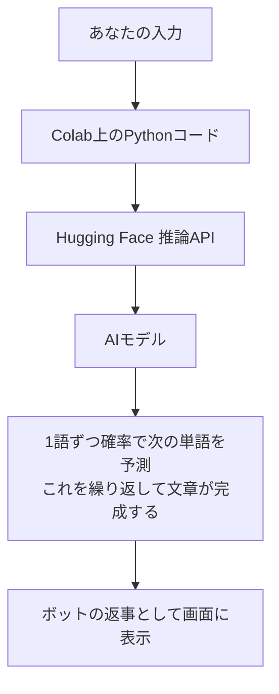

この記事を読むと、プログラミング経験がなくても、ブラウザだけで自分だけのAIチャットボットを動かせるようになります。クレジットカード登録や環境構築は一切不要です。

## さっそく動かしてみよう

使うのは [Google Colab](https://colab.research.google.com/) というブラウザ上で動くノートブックだけです。パソコンに何かをインストールする必要はありません。

### 事前準備（1回だけ）

1. [Hugging Face](https://huggingface.co/join) の無料アカウントを作る
2. [アクセストークンの発行ページ](https://huggingface.co/settings/tokens)で「New token」→ 権限は「Read」のままでOK → トークンを発行してコピーしておく
3. Colabで新しいノートブックを開き、左側の🔑（シークレット）アイコンをクリック
4. 「新しいシークレットを追加」で、名前を `HF_TOKEN`、値に先ほどコピーしたトークンを貼り付けて登録し、「ノートブックからのアクセス」をオンにする

これで準備完了です。あとは次の3つのコードを、上から順番にセルにコピペして実行するだけです。

### セル1：トークンを安全に取り出す

```python
from google.colab import userdata
HF_TOKEN = userdata.get('HF_TOKEN')
```

実行すると「このノートブックが HF_TOKEN へのアクセスを求めています」というダイアログが出ます。これは想定通りの動作なので、「アクセスを許可」を押してください。

### セル2：AIに質問する関数を作る

```python
import requests

API_URL = "https://router.huggingface.co/v1/chat/completions"
MODEL_NAME = "meta-llama/Llama-3.1-8B-Instruct"

def ask(messages):
    response = requests.post(
        API_URL,
        headers={"Authorization": f"Bearer {HF_TOKEN}"},
        json={
            "model": MODEL_NAME,
            "messages": messages,
            "max_tokens": 200,
            "temperature": 0.7,  # 数式での意味は後半で説明します
        },
        timeout=30,
    )
    response.raise_for_status()
    return response.json()["choices"][0]["message"]["content"]
```

### セル3：チャットループ

```python
messages = [
    {"role": "system", "content": "あなたは親しみやすいアシスタントです。日本語で分かりやすく答えてください。"}
]

print("準備完了！「bye」と入力すると終了します。\n")

while True:
    user_input = input("あなた: ")
    if user_input.strip().lower() in ("bye", "exit", "quit"):
        print("ボット: またね！")
        break

    messages.append({"role": "user", "content": user_input})
    reply = ask(messages)
    print(f"ボット: {reply}\n")
    messages.append({"role": "assistant", "content": reply})
```

実際に動かすと、こんな会話になります（実際に動作確認した結果そのままです）。

```
あなた: こんにちは！あなたは誰ですか？
ボット: こんにちは！あなたの私たちアシスタントです。AIを使用して、答えや情報を提供いたします。どんな質問でも受け付けて、お役に立てるようにします。

あなた: 私はプログラミング初心者です。おすすめの勉強方法を教えて。
ボット: 初心者なので、順を追って勉強してみてください。

1. オンラインコース: Codecademy、FreeCodeCamp、Udemyなどのサイトで、プログラミングの基礎から学べます。
2. YouTube: プログラミングの動画教室がたくさんあります。
3. ブログ: プログラミングの基礎から中級までの情報が載っています。
4. 実行する: プログラミングは実行するのが一番の学習方法です。

あなた: ありがとう！最後に一言、応援してください。
ボット: 頑張って！プログラミングは経験と実践が必要です。失敗も怖くないように、実行してみることが大切です。自分を褒めて、少しずつ進んでいってください。成功する！

あなた: bye
ボット: またね！
```

ちゃんと会話が続いていますね。次は、このコードが何をしているのか1行ずつ見ていきましょう。

## コードを1行ずつ読んでみよう

### セル1：シークレットの読み出し

```python
from google.colab import userdata
HF_TOKEN = userdata.get('HF_TOKEN')
```

`HF_TOKEN` は、あなたとHugging Faceのサービスとの間の「合言葉」のようなものです。もしこの合言葉がコードの中に直接書いてあって、そのコードを誰かと共有してしまうと、他人があなたの代わりにサービスを使えてしまいます。それを防ぐために、Colabの「シークレット」という金庫のような場所に保管し、`userdata.get()` で必要なときだけ安全に取り出す、という仕組みになっています。

### セル2：関数（かんすう）を作る

関数とは、「材料を渡すと、決まった処理をして結果を返してくれる装置」のようなものです。ここでは `ask(messages)` という関数を作っていて、「これまでの会話（messages）」を渡すと、「AIの返事」を返してくれます。

```python
response = requests.post(
    API_URL,
    headers={"Authorization": f"Bearer {HF_TOKEN}"},
    json={
        "model": MODEL_NAME,
        "messages": messages,
        "max_tokens": 200,
        "temperature": 0.7,
    },
    timeout=30,
)
```

`requests.post(...)` は、インターネット越しに「このURL(API_URL)に、この内容(json)を送ってください」とお願いするコードです。送っている内容は次の4つです。

- `model`: どのAIモデルを使うか
- `messages`: これまでの会話の記録（あなたが何を言い、AIが何を返したか）
- `max_tokens`: AIの返事の最大の長さ
- `temperature`: AIの返事の「バラつき具合」を決める数字（詳しくは後述）

### セル3：会話を繰り返す

```python
while True:
    user_input = input("あなた: ")
    if user_input.strip().lower() in ("bye", "exit", "quit"):
        ...
        break
    ...
```

`while True:` は「ずっと繰り返す」という意味です。`input()` で入力を待ち、`bye` などが入力されたら `break` でループを抜けます。それ以外の場合は `messages` に会話を追加してAIに質問し、返ってきた返事も `messages` に追加します。この「今までの会話を全部渡す」という部分があるからこそ、AIは会話の流れを覚えているように振る舞えるのです。

## なぜ返事が返ってくるの？（直感編）

ここで使っているAI（大規模言語モデル）は、ものすごくたくさんの文章を読んで学習した「言葉の当てっこ」の達人だと考えてください。

例えば「今日は天気が良いので、公園に」という文章を見せられたら、次にどんな言葉が来そうか、あなたも何となく予想できますよね。「行く」かもしれないし、「散歩する」かもしれません。AIはこれを、大量の文章から学んだ経験をもとに、一つ一つの単語について「確率」という数字をつけて予想しています。そして、その予想を1単語ずつ繰り返すことで、文章全体を作り出しているのです。

全体の流れを図にすると、こうなります。



## （ちょっと深掘り）確率でひとこと覗いてみる

先ほどセル2に出てきた `temperature` という数字、実はこの「単語の当てっこ」の性格を決める、重要なつまみです。

直感的に言うと、`temperature` が小さいと、AIは「一番自信のある単語」をほぼ確実に選ぶようになり、返事は手堅く安定しますが、少し単調になります。逆に `temperature` が大きいと、AIは自信度の低い単語も選びやすくなり、返事にバラエティが出ますが、たまに突飛な返事をすることもあります。

これを数式で表すと、次のようになります。ある単語 $i$ が選ばれる確率 $P(i)$ は、その単語の「スコア」を $x_i$、温度を $T$ として、

$$
P(i) = \frac{\exp(x_i / T)}{\sum_j \exp(x_j / T)}
$$

という式（ソフトマックス関数）で計算されます。ここでのポイントは、$T$ が分母（というより指数の中）に入っている点です。$T$ が小さいほど、スコアの差が指数関数的に強調されて「一番良いスコアの単語」がますます選ばれやすくなり、$T$ が大きいほど、スコアの差が薄まって色々な単語が選ばれやすくなります。

実際に「今日は天気が良いので、公園に＿＿」の続きの単語候補で、$T=0.3$ と $T=1.5$ の場合の確率を計算して比べてみましょう。


$T=0.3$ ではほぼ「行く」一択なのに対し、$T=1.5$ では「花」や「宇宙船」のような一見関係なさそうな単語にもそれなりの確率が与えられているのが分かります。セル2で `temperature: 0.7` としていたのは、「手堅さ」と「表現のバラエティ」のバランスを取るための、よくある設定値です。

## チャットボットをカスタマイズしてみよう

セル3の一番上にある `system` の内容を書き換えるだけで、ボットの性格や話し方を変えられます。

```python
messages = [
    {"role": "system", "content": "あなたは語尾に「〜だぜ！」をつける、元気いっぱいのアシスタントです。日本語で答えてください。"}
]
```

`system` はAIに対して「あなたはこういう役割・性格です」と最初に伝えておくメッセージです。ここを書き換えて、自分だけのキャラクターのチャットボットを作って、実際にどんな返事になるか試してみてください。

## つまずきやすいポイント Q&A

**Q. 「HF_TOKENへのアクセスを許可しますか？」と出た**
A. 想定通りの動作です。「アクセスを許可」を押して進めてください。

**Q. モデルに関する権限エラーが出た**
A. 今回使っている `meta-llama/Llama-3.1-8B-Instruct` はMeta社のライセンス条項があるモデルです。エラーが出た場合は、[モデルのページ](https://huggingface.co/meta-llama/Llama-3.1-8B-Instruct)を開いて「Agree and access repository」を押してから、もう一度セルを実行してみてください。

**Q. 「not supported by any provider」のようなエラーが出た**
A. 無料の推論APIで使えるモデルは時々変わることがあります。その場合は `MODEL_NAME` を他の対応モデルに変えてみてください。

**Q. しばらく使うとエラーが増える**
A. 無料枠には利用回数の制限があります。少し時間を置いてから再度試してください。

## まとめと次のステップ

たった3つのセルで、自分だけのAIチャットボットが動かせることが確認できました。ここからさらに発展させたい人は、次のようなテーマがおすすめです。

- 会話の履歴を長く保存して、より自然な会話にする
- 他のモデルを試して、返事の個性の違いを比べてみる
- AIが「間違った自信満々の返事」をすることがある理由を学ぶ

まずは自分だけのチャットボットで、色々な話しかけ方を試してみてください。
