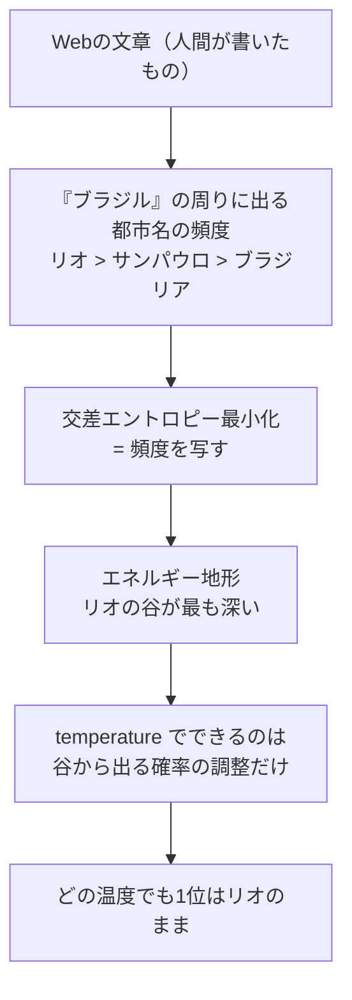

この記事を読むと、LLMが自分の答えに配る確率（確信度）が「正しさ」の物差しにはなっていないことを、自分の手で測って確認できます。ついでに、`temperature` を0にしても嘘が消えないのはなぜかが、統計力学の言葉で一本につながります。

GPUは不要です。152Mパラメータのモデルと numpy をCPUで動かすだけで最後まで通ります。載せているコードは作図まで含んでいるので、上から順にコピペすると記事と同じ図が手元に出ます。

[前回まで](https://zenn.dev/m2yagyu/articles/llm-temperature-boltzmann)、LLMが次の単語を確率的に選んでいること、その確率を鈍らせるつまみが `temperature` であること、そしてそれが統計力学の温度と同じ式であることを測ってきました。そのとき最後に「ばらつくことと間違えることは別だ」と一行だけ書いて、証明せずに置いていきました。**この記事はその宿題です。**

## AIに世界の首都を聞くと、どこで間違えるのか

### 何を測ると「確信度」を測ったことになるのか

LLMは文章を一気に思いつくのではなく、次の1トークンの確率分布を作り、そこから1個引く、を繰り返しています。だから「モデルがどれくらい自信を持っているか」は、追加の仕掛けを何も使わずに読めます。**モデルが選んだトークンに、そのモデル自身が配った確率**がそれです。

そこで、答え方の例を2つだけ見せて続きを書かせる形（few-shot）で、15カ国の首都を聞きます。

```
日本の首都は東京です。フランスの首都はパリです。ブラジルの首都は
```

この直後の1トークンの分布を見れば、モデルが何を答えようとしていて、その答えにどれだけの確率を配ったかが分かります。さらに、**正解のトークンがその分布の何番目にいるか**も同時に読めます。これが後で効いてきます。

以降この記事で「正解の確率」「順位」と書くとき、それは次の量を指します。

- 首都名は複数トークンに割れることがある（「ブラジリア」は文脈中では `['ブラ', 'ジ', 'リア']` になる）ので、測るのは**正解の先頭トークン**についての値
- 順位は**語彙99,584トークン全体**を確率の高い順に並べたときの位置。あとで出てくる上位6語の図の中での順位ではない

言語モデルの評価では、この正解トークンの順位を集計して平均逆順位（MRR）や Recall@k といった指標にしますが、ここでは1問ずつの生の順位をそのまま見ます。

モデルは前回・前々回と同じ `llm-jp/llm-jp-3-150m` です。日本語で学習された152Mパラメータの小さなモデルで、CPUで動きます。

:::message
「`HF_TOKEN` へのアクセスを許可しますか？」というダイアログが出た場合は、キャンセルで問題ありません。今回使うモデルは誰でもダウンロードできる公開モデルなので、トークンは不要です。「未認証なのでダウンロード速度の制限が厳しめになる」という警告が出ることがありますが、エラーではありません。
:::

```python
try:
    import matplotlib_fontja  # noqa: F401
except ModuleNotFoundError:
    import subprocess, sys
    subprocess.check_call([sys.executable, "-m", "pip", "install", "-q", "matplotlib-fontja"])
    import matplotlib_fontja  # noqa: F401

import torch
import torch.nn.functional as F
import matplotlib.pyplot as plt
from transformers import AutoTokenizer, AutoModelForCausalLM

MODEL = "llm-jp/llm-jp-3-150m"
tok = AutoTokenizer.from_pretrained(MODEL)
model = AutoModelForCausalLM.from_pretrained(MODEL)
model.eval()

# 答え方を2例だけ見せて、続きを書かせる（few-shot）
SHOT = "日本の首都は東京です。フランスの首都はパリです。"

REAL = [("イタリア", "ローマ"), ("ドイツ", "ベルリン"), ("イギリス", "ロンドン"),
        ("オーストラリア", "キャンベラ"), ("アメリカ", "ワシントン"), ("ブラジル", "ブラジリア"),
        ("カナダ", "オタワ"), ("トルコ", "アンカラ"), ("スイス", "ベルン"),
        ("中国", "北京"), ("韓国", "ソウル"), ("インド", "ニューデリー"),
        ("スペイン", "マドリード"), ("エジプト", "カイロ"), ("ニュージーランド", "ウェリントン")]


def next_logits(country):
    """「◯◯の首都は」の直後、次の1トークンのlogits"""
    ids = tok(SHOT + f"{country}の首都は", return_tensors="pt").input_ids
    with torch.no_grad():
        return model(ids).logits[0, -1]


def gold_id(country, answer):
    """その文脈で正解を書き出すときの先頭トークンID。
    「ブラジリア」は単独では['ブラ','ジ','リア']に割れるので、
    文の途中に置いた状態で切り出さないと、モデルが実際に出すIDと一致しない"""
    a = tok(SHOT + f"{country}の首都は").input_ids
    b = tok(SHOT + f"{country}の首都は{answer}").input_ids
    return b[len(a)]


def greedy(country, n=8):
    """常に最大確率のトークンを選ぶ（temperature=0 と同じ）"""
    ids = tok(SHOT + f"{country}の首都は", return_tensors="pt").input_ids
    k = 0
    for _ in range(n):
        with torch.no_grad():
            nxt = int(model(ids).logits[0, -1].argmax())
        ids = torch.cat([ids, torch.tensor([[nxt]])], dim=1)
        k += 1
        if tok.decode([nxt]).endswith("。"):
            break
    return tok.decode(ids[0, -k:]).replace("です。", "")


rows = []
for country, gold in REAL:
    lg = next_logits(country)
    p = F.softmax(lg, dim=-1)
    gid = gold_id(country, gold)
    rows.append(dict(country=country, gold=gold, out=greedy(country), logits=lg,
                     conf=float(p.max()),                       # 出した答えへの確信度
                     p_gold=float(p[gid]),                      # 正解の先頭トークンに配られた確率
                     rank=int((p > p[gid]).sum()) + 1,          # 語彙全体での順位（同率なら最上位）
                     ent=float(-(p * p.clamp_min(1e-12).log()).sum()),
                     ok=(int(p.argmax()) == gid)))

print(f"{'国':<9}{'正解':<9}{'モデルの答え':<13}{'確信度':>7}{'正解の確率':>10}{'順位':>6}")
for r in rows:
    print(f"{r['country']:<9}{r['gold']:<9}{r['out']:<13}{r['conf']:>7.3f}"
          f"{r['p_gold']:>10.4f}{r['rank']:>6}  {'○' if r['ok'] else '×'}")
n_ok = sum(r["ok"] for r in rows)
print(f"\n正解率: {n_ok}/{len(rows)} = {n_ok / len(rows):.3f}")

order = sorted(rows, key=lambda r: r["conf"])
fig, ax = plt.subplots(figsize=(9, 6))
ax.barh([r["country"] for r in order], [r["conf"] for r in order],
        color=["#2563eb" if r["ok"] else "#dc2626" for r in order])
for i, r in enumerate(order):
    ax.text(r["conf"] + 0.012, i, r["out"], va="center", fontsize=10)
ax.set_xlim(0, 1.25)
ax.set_xlabel("自分の答えに配った確率（確信度）")
ax.set_title("青＝正解 / 赤＝不正解。確信度の高さは正しさを意味しない")
fig.tight_layout()
plt.show()
```

```
国        正解       モデルの答え           確信度     正解の確率    順位
イタリア     ローマ      ローマ            0.307    0.3066     1  ○
ドイツ      ベルリン     ベルリン           0.742    0.7422     1  ○
イギリス     ロンドン     ロンドン           0.945    0.9453     1  ○
オーストラリア  キャンベラ    シドニー           0.424    0.0005    36  ×
アメリカ     ワシントン    ニューヨーク         0.508    0.1982     2  ×
ブラジル     ブラジリア    リオデジャネイロ       0.773    0.0125     4  ×
カナダ      オタワ      バンクーバー         0.520    0.0012    21  ×
トルコ      アンカラ     イスタンブール        0.184    0.0435     4  ×
スイス      ベルン      スイス            0.594    0.0033    20  ×
中国       北京       北京             0.793    0.7930     1  ○
韓国       ソウル      ソウル            0.855    0.8555     1  ○
インド      ニューデリー   デリー            0.652    0.0009    69  ×
スペイン     マドリード    マドリード          0.484    0.4844     1  ○
エジプト     カイロ      エジプト           0.465    0.1514     2  ×
ニュージーランド ウェリントン   ニュージーランド       0.504    0.0388     4  ×

正解率: 6/15 = 0.400
```


### 効いている行

正解トークンの順位を測るところが、この記事の全体を通じて効きます。

```python:抜粋
gid = gold_id(country, gold)
rank=int((p > p[gid]).sum()) + 1,          # 語彙全体での順位（同率なら最上位）
```

語彙99,584個のうち、正解トークンより確率の高いものが何個あるかを数えているだけです。順位が1位なら正解が出ますし、4位なら出ません。あとで見るように、**この順位こそが温度をどう動かしても変わらない量**です。

`gold_id` が回りくどい形をしているのには理由があります。「ブラジリア」を単独でトークン化すると `['ブラ', 'ジ', 'リア']` に割れますが、文の途中に置いたときの分割はそれと一致するとは限りません。単独でトークン化したIDを正解として使うと、モデルが実際に出すIDと照合できず、正解率が0になります（実際に一度そうなりました）。文脈ごと入れて差分を取るのが確実です。

## 確信度の順に並べると、何が見えるか

図をもう一度見てください。上から3本が正解、4本目が誤答です。数字で並べるとこうなります。

| 国 | モデルの答え | 正誤 | 確信度 |
|---|---|---|---|
| ブラジル | リオデジャネイロ | **誤** | **0.773** |
| ドイツ | ベルリン | 正 | 0.742 |
| イタリア | ローマ | 正 | 0.307 |

**間違えた「リオデジャネイロ」への確信度 0.773 は、正解した「ベルリン」の 0.742 より高く、正解した「ローマ」の 0.307 の2倍以上あります。** 確信度で並べ替えても、正解と誤答は分離しません。

これは小さいモデルだからではありません。ニューラルネットが出す確率が「正しさの確率」からずれることは、画像分類の時代から系統的に測られてきた性質です（[Guo et al., *On Calibration of Modern Neural Networks*](https://arxiv.org/abs/1706.04599)）。モデルが出しているのは正しさの見積もりではなく、**学習データの中でのもっともらしさ**です。

## なぜ間違いは「その国で二番目に有名な都市」に集中するのか

誤答を並べ直すと、性質がはっきりします。

| 国 | モデルの答え | 正解 |
|---|---|---|
| オーストラリア | シドニー | キャンベラ |
| アメリカ | ニューヨーク | ワシントン |
| ブラジル | リオデジャネイロ | ブラジリア |
| カナダ | バンクーバー | オタワ |
| トルコ | イスタンブール | アンカラ |

9個の誤答のうち5個が、**その国の首都ではないが、その国で最も有名な都市**です。誤答がランダムなノイズなら、こんな偏り方はしません。バンクーバーとオタワを取り違える確率と、バンクーバーとレイキャビクを取り違える確率が同じになるはずです。

つまり嘘は、構造を持っています。モデルは「ブラジル」という文脈で最も一緒に出てきやすい都市名を出しました。その語がたまたま首都ではなかった、というだけです。人間が引っかかるのと同じ問題に引っかかっているのは偶然ではなく、**人間が書いた文章の頻度をそのまま写している**からです。同じ構造は、人間の誤解をモデルが再現するかを測るベンチマークでも報告されています（[Lin et al., *TruthfulQA*](https://arxiv.org/abs/2109.07958)）。

残りの誤答も見ておくと、スイス・エジプト・ニュージーランドでは国名をそのまま繰り返し、インドでは「ニューデリー」ではなく「デリー」を出しています。惜しいものと的外れなものが混ざっていますが、どれも「文脈から見てもっともらしい語」であることは共通しています。

## 温度を下げれば嘘は減るのか、上げれば当たるのか

ここからが本題です。ハルシネーションを抑えたいときに `temperature` を0にする、という運用は広く行われています。それが効くかどうかを、つまみの両方向について測ります。

下げる方向は、実はもう測り終わっています。上の実験は常に最大確率のトークンを選ぶ（= `temperature=0`）方式なので、何度実行しても一字一句同じ答えが返ります。**ばらつきはゼロです。それでも15問中9問間違えています。**

では上げる方向はどうでしょうか。分布を鈍らせれば、いま4位に沈んでいる正解が出てくる目もありそうに見えます。温度を掃引して、次の2つを同時に測ります。

- **正解が出る確率**: その温度の分布で正解トークンを引く確率を、15カ国で平均したもの
- **実質的な選択肢の数**: エントロピー $H$ から $e^{H}$ を計算したもの。「何通りの答えを引きうるか」を1つの数にしたもので、$e^H = 1$ なら答えは1つに固定、$e^H = 100$ なら実質100通りから引いている、という読み方をします

サンプリングを繰り返す必要はありません。分布そのものから期待値として計算できます。

```python
import numpy as np

Ts = np.unique(np.concatenate([np.geomspace(0.1, 5.0, 40), [0.1, 0.5, 1.0, 2.0, 5.0]]))
L = torch.stack([r["logits"] for r in rows])
gold_ids = [gold_id(r["country"], r["gold"]) for r in rows]

acc, choices = [], []
for T in Ts:
    pT = F.softmax(L / T, dim=-1)
    acc.append(float(pT[range(len(rows)), gold_ids].mean()))       # 正解が出る確率の平均
    H = -(pT * pT.clamp_min(1e-12).log()).sum(-1)
    choices.append(float(H.exp().mean()))                          # 実質的な選択肢の数

print(f"{'T':>6}{'正解が出る確率':>14}{'実質的な選択肢の数':>18}")
for T in [0.1, 0.5, 1.0, 2.0, 5.0]:
    j = int(np.abs(Ts - T).argmin())
    print(f"{Ts[j]:6.2f}{acc[j]:14.3f}{choices[j]:18.1f}")
print(f"\n選択肢の数は {choices[0]:.1f} → {choices[-1]:.0f} 倍率 {choices[-1] / choices[0]:.0f}")
print(f"正解率の最大値 {max(acc):.3f}（T={Ts[int(np.argmax(acc))]:.2f}）、T→0での貪欲正解率 {n_ok / len(rows):.3f}")

fig, ax = plt.subplots(figsize=(8, 5))
ax.plot(Ts, acc, color="#2563eb", lw=2.5, label="正解が出る確率")
ax.axhline(n_ok / len(rows), color="#2563eb", ls=":", lw=1.2)
ax.set_xscale("log"); ax.set_xlabel("temperature T"); ax.set_ylabel("正解が出る確率", color="#2563eb")
ax.set_ylim(0, 0.55); ax.tick_params(axis="y", labelcolor="#2563eb")
ax2 = ax.twinx()
ax2.plot(Ts, choices, color="#dc2626", lw=2.5, ls="--", label="実質的な選択肢の数")
ax2.set_yscale("log"); ax2.set_ylabel("実質的な選択肢の数 exp(H)", color="#dc2626")
ax2.tick_params(axis="y", labelcolor="#dc2626")
ax.set_title("ばらつきは67,000倍になるのに、正解率は一度も上がらない")
fig.legend(loc="upper left", bbox_to_anchor=(0.13, 0.88))
fig.tight_layout()
plt.show()
```

```
     T       正解が出る確率         実質的な選択肢の数
  0.10         0.369               1.2
  0.50         0.357               1.6
  1.00         0.305              15.9
  2.00         0.029            8832.0
  5.00         0.000           78336.0

選択肢の数は 1.2 → 78336 倍率 67295
正解率の最大値 0.379（T=0.11）、T→0での貪欲正解率 0.400
```


### ばらつきは67,000倍になるのに、正解率は一度も上がらない

温度を 0.1 から 5 まで動かすと、実質的な選択肢の数は **1.2通りから78,336通りへ、約67,000倍** に増えます。出力の多様性という意味では、これ以上ないほど大きく動いています。

その間、正解が出る確率は 0.369 から 0.000 まで、**一度も上がらずに落ちていくだけ**です。最も高いのは掃引した中で最も低温の $T = 0.11$ で、しかもその値 0.379 は、温度を完全に0にしたときの 0.400 に届いていません。

つまり温度は、正しさに無関係なつまみではありません。**正解率を下げる方向にだけ効きます。** 上げる方向には効きません。次の節で見るように、温度は確率の大小関係を保つので、貪欲に選んだとき（常に1位のトークンを採るとき）に正解する問題数 6/15 は、温度をどう動かしても変わらないからです。**到達できる正解率の上限 0.400 は学習の時点で決まっていて、温度にできるのはそこへ近づくか、そこから落ちるかだけ**です。

これが「ばらつくことと間違えることは別」の中身です。2本の線は同じ軸を共有していません。ばらつきの軸では温度は67,000倍の幅を持つのに、正しさの軸では上限を1ミリも押し上げられません。

`temperature` を下げると出力が安定するので、「安定した＝信頼できるようになった」と感じます。実際に起きているのは、**同じ嘘を毎回きっちり再現するようになった**ことです。

## 温度は分布の何を変えて、何を変えないのか

なぜこうなるのかは、式を見ると1行で分かります。`temperature` は softmax の中で次のように働きます。

$$
p_i(T) = \frac{e^{z_i / T}}{\sum_j e^{z_j / T}}
$$

$z_i$ はモデルが出した各トークンのスコア（logits）です。統計力学の言葉に直すなら、$E_i = -z_i$ をエネルギーと呼べば、これは温度 $T$ のボルツマン分布そのものです。

$$
p_i(T) = \frac{e^{-E_i / T}}{Z}, \qquad Z = \sum_j e^{-E_j / T}
$$

この式で $T$ を変えたときに何が起きるかを見ます。$z_i > z_k$ という2つのトークンについて、

$$
\frac{p_i(T)}{p_k(T)} = e^{(z_i - z_k) / T}
$$

$z_i - z_k > 0$ なので、この比は $T$ がどんな正の値でも必ず1より大きいままです。**つまり $T$ をどう動かしても、確率の大小関係は絶対に入れ替わりません。** 温度は比の大きさを変えるだけで、符号を変えられません。

$T \to 0$ ならこの比は無限大に発散して1位だけが残り、$T \to \infty$ なら1に近づいて一様分布になります。どちらの極でも順位は同じです。実際に確かめます。

```python
br = next((r for r in rows if r["country"] == "ブラジル"))
p1 = F.softmax(br["logits"], dim=-1)
top = torch.topk(p1, 6)
labels = [tok.decode([i]) for i in top.indices.tolist()]
gid = gold_id("ブラジル", "ブラジリア")

fig, axes = plt.subplots(1, 3, figsize=(12, 4), sharey=True)
for ax, T in zip(axes, [0.5, 1.0, 2.0]):
    pT = F.softmax(br["logits"] / T, dim=-1)[top.indices]
    ax.bar(range(6), pT.tolist(),
           color=["#16a34a" if i == gid else "#94a3b8" for i in top.indices.tolist()])
    ax.set_xticks(range(6)); ax.set_xticklabels(labels, rotation=60, ha="right", fontsize=9)
    ax.set_yscale("log"); ax.set_ylim(1e-7, 3)
    ax.set_title(f"T = {T}")
axes[0].set_ylabel("確率（対数目盛）")
fig.suptitle("温度を変えても、棒の高さの「順番」は入れ替わらない（緑＝正解ブラジリア）")
fig.tight_layout()
plt.show()

print("順位は温度に依存しない（上位6語のIDの並び）")
for T in [0.2, 1.0, 5.0, 50.0]:
    idx = torch.topk(F.softmax(br["logits"] / T, dim=-1), 6).indices.tolist()
    print(f"  T={T:5.1f}  {[tok.decode([i]) for i in idx]}")
```

```
順位は温度に依存しない（上位6語のIDの並び）
  T=  0.2  ['リオ', 'ブラジル', 'サン', 'ブラ', 'コ', 'ボ']
  T=  1.0  ['リオ', 'ブラジル', 'サン', 'ブラ', 'コ', 'ボ']
  T=  5.0  ['リオ', 'ブラジル', 'サン', 'ブラ', 'コ', 'ボ']
  T= 50.0  ['リオ', 'ブラジル', 'サン', 'ブラ', 'コ', 'ボ']
```


温度を250倍動かしても、上位6語の並びは1文字も変わりません。正解の「ブラ」（ブラジリアの先頭）は、どの温度でも4番目のままです。

:::message
`top_k` や `top_p` は、この順位の**下から切り落とす**操作です。順位そのものは変えないので、4位の正解を1位に持ち上げることはできません。むしろ `top_k=3` にすると正解は候補から消えます。サンプリング手法が何をしていて何をしていないかは [Holtzman et al., *The Curious Case of Neural Text Degeneration*](https://arxiv.org/abs/1904.09751) が詳しいです。
:::

## 谷の位置は誰が決めているのか

順位が温度で変わらないなら、順位はどこで決まったのか。学習です。

$E_i = -\log p_i$ をエネルギーとして、ブラジルの文脈での上位6語を並べてみます。

```python
E = -torch.log(p1[top.indices])
fig, ax = plt.subplots(figsize=(8, 5))
ax.plot(range(6), E.tolist(), color="#334155", lw=2)
for x, (e, tid) in enumerate(zip(E.tolist(), top.indices.tolist())):
    ax.scatter(x, e, s=140, zorder=3, color="#16a34a" if tid == gid else "#334155")
    ax.annotate(f"{float(p1[tid]):.3f}", (x, e), xytext=(0, -18),
                textcoords="offset points", ha="center", fontsize=9)
ax.set_xticks(range(6)); ax.set_xticklabels(labels, rotation=30, ha="right")
ax.set_ylabel("エネルギー $E = -\\log p$（低いほど選ばれやすい）")
ax.set_ylim(-0.4, E.max().item() + 0.6)
ax.set_title("選ばれやすい順に並べたエネルギー。正解ブラジリア（緑）は4番目")
fig.tight_layout()
plt.show()

print(f"{'トークン':<12}{'確率':>9}{'E=-log p':>10}")
for v, tid in zip(top.values.tolist(), top.indices.tolist()):
    mark = "  ← 正解" if tid == gid else ""
    print(f"{tok.decode([tid]):<12}{v:9.4f}{-np.log(v):10.2f}{mark}")
```

```
トークン               確率  E=-log p
リオ             0.7734      0.26
ブラジル           0.0767      2.57
サン             0.0320      3.44
ブラ             0.0125      4.38  ← 正解
コ              0.0071      4.95
ボ              0.0063      5.07
```


正解のブラジリアは、消えているわけではありません。確率1.25%、エネルギー4.38の位置にちゃんといます。**モデルはブラジリアを知っています。ただ、リオデジャネイロの谷のほうが4.1だけ深いのです。**

### 学習の目的関数のどこにも「真偽」は入っていない

言語モデルの学習は、次の交差エントロピーを最小化します。

$$
\mathcal{L} = -\sum_{t} \log q_\theta(w_t \mid w_{<t})
$$

$q_\theta$ がモデルの分布、$w_t$ が学習データに実際に書かれていた次の単語です。**学習データに出てきた単語に、モデルがなるべく高い確率を配るようにする**、と読めます。

この式は、もう少し見通しのよい形に書き換えられます。2つの確率分布のずれを測る量として、KLダイバージェンスというものがあります。

$$
D_{\mathrm{KL}}(p_\text{data} \parallel q_\theta) = \sum_i p_\text{data}(i) \log \frac{p_\text{data}(i)}{q_\theta(i)}
$$

見た目は仰々しいですが、ここで使うのは次の3つの性質だけです。2つの分布が完全に一致するとき0になり、それ以外では必ず正になり、離れているほど大きくなります。$p$ と $q$ を入れ替えると値が変わるので「距離」とは呼びませんが、**ずれの大きさの目盛り**だと思って読んで差し支えありません。

そして、$\mathcal{L}$ を学習データのトークン数で割って1トークンあたりの平均にすると、それは $D_{\mathrm{KL}}(p_\text{data} \parallel q_\theta)$ に**データ側だけで決まる定数**（データ分布そのもののエントロピー）を足したものになります。この定数はモデルのパラメータ $\theta$ をまったく含まないので、微分すれば消えます。つまり交差エントロピーを小さくすることと、$D_{\mathrm{KL}}$ を小さくすること、すなわち**モデルの分布をデータの分布にぴったり重ねにいくことは、完全に同じ操作**です。

**この式のどこにも、$w_t$ が事実かどうかを表す項はありません。** 入っているのは「学習データでその語がどれだけ出てきたか」だけです。だから最小化の答えは、真実ではなく頻度になります。この「重ねにいく」がどこまで徹底しているかは、後半のトイモデルで数値として確かめます。



これが、ハルシネーションを「バグ」と呼びにくい理由です。目的関数どおりに学習した結果として出てきています（この整理は [Ji et al., *Survey of Hallucination in Natural Language Generation*](https://arxiv.org/abs/2202.03629) が体系的にまとめています）。

## なぜAIは「知らない」と言えないのか

ここで、もう一段深い制約に触れます。実在しない国の首都を聞いてみます。

正解が存在しないので、期待する答えは「そんな国はありません」です。ところがモデルの出力は確率分布なので、**総和が必ず1になります**。統計力学でいえば、分配関数 $Z$ で割って規格化された分布です。「系は必ず何らかの状態にいる」という条件が、そのまま「モデルは必ず何らかのトークンを出す」になっています。

「該当なし」という出口は、語彙の中に用意されていません。強いて言えば「不明」「わかりません」といった語がありますが、それらは他の語と同じ土俵で確率を奪い合う、ただのトークンです。その確率が実際どれくらいあるのかを測ります。

```python
FAKE = ["ズヴェルギア共和国", "エルドニア連邦", "カルヴァニア王国"]
UNKNOWN = ["不明", "わかりません", "分かりません", "存在しません",
           "知られていません", "不詳", "特にありません", "無い"]


def first_diff_id(country, word):
    a = tok(SHOT + f"{country}の首都は").input_ids
    b = tok(SHOT + f"{country}の首都は{word}").input_ids
    k = next((j for j in range(min(len(a), len(b))) if a[j] != b[j]), len(a))
    return b[k]


unk_ids = sorted({first_diff_id("ブラジル", w) for w in UNKNOWN})

print(f"{'国':<12}{'モデルの答え':<14}{'確信度':>7}{'P(知らない系)':>14}")
fake_rows = []
for country in FAKE:
    p = F.softmax(next_logits(country), dim=-1)
    fake_rows.append(dict(country=country, out=greedy(country), conf=float(p.max()),
                          ent=float(-(p * p.clamp_min(1e-12).log()).sum()),
                          unk=float(p[unk_ids].sum()), ok=False, fake=True))
    print(f"{country:<12}{fake_rows[-1]['out']:<14}{fake_rows[-1]['conf']:>7.3f}"
          f"{fake_rows[-1]['unk']:>14.5f}")
for r in rows:
    r["unk"] = float(F.softmax(r["logits"], dim=-1)[unk_ids].sum())
for r in rows[:3]:
    print(f"{r['country']:<12}{r['out']:<14}{r['conf']:>7.3f}{r['unk']:>14.5f}")

real_unk = float(np.mean([r["unk"] for r in rows]))
fake_unk = float(np.mean([r["unk"] for r in fake_rows]))
print(f"\n実在15カ国の平均 P(知らない系) = {real_unk:.6f}")
print(f"架空 3カ国の平均 P(知らない系) = {fake_unk:.6f}  （{fake_unk / real_unk:.1f}倍）")

fig, ax = plt.subplots(figsize=(8, 4.5))
names = [r["country"] for r in rows] + [r["country"] for r in fake_rows]
vals = [r["unk"] for r in rows] + [r["unk"] for r in fake_rows]
ax.bar(names, vals, color=["#94a3b8"] * len(rows) + ["#f59e0b"] * len(fake_rows))
ax.axhline(1.0, color="#334155", ls="--", lw=1)
ax.text(0.2, 0.35, "確率の総和は必ず 1（灰＝実在の国 / 橙＝架空の国）", fontsize=10)
ax.set_yscale("log"); ax.set_ylim(1e-6, 3)
ax.set_ylabel("「知らない」系の語に配られた確率")
plt.setp(ax.get_xticklabels(), rotation=60, ha="right", fontsize=9)
ax.set_title("架空の国でも「知らない」の確率はほぼゼロのまま")
fig.tight_layout()
plt.show()
```

```
国           モデルの答え            確信度      P(知らない系)
ズヴェルギア共和国   ヴェルサイユ          0.080       0.00006
エルドニア連邦     パリ              0.063       0.00009
カルヴァニア王国    パリ              0.079       0.00012
イタリア        ローマ             0.307       0.00008
ドイツ         ベルリン            0.742       0.00001
イギリス        ロンドン            0.945       0.00001

実在15カ国の平均 P(知らない系) = 0.000037
架空 3カ国の平均 P(知らない系) = 0.000091  （2.4倍）
```


存在しない国について、モデルは「ヴェルサイユ」「パリ」と即答しました。ためらった様子はありません。

「知らない」系の語に配られた確率は、架空の国では実在の国の2.4倍に増えています。増えてはいるのです。ただし **0.0037% が 0.0091% になっただけ**で、残りの99.99%は変わらず都市名に配られています。この分布からサンプリングする限り、「知りません」が出てくることは実質的にありません。

これは語彙の設計の問題ではなく、学習データの問題です。Webの文章に「◯◯の首都は」と書き出して「知りません」と続く例は、ほとんど存在しません。頻度を写す学習では、書かれていない振る舞いは学べません。**知らないと言えるモデルを作るには、学習の後段（RLHFなど）で別途そう振る舞うように教えるしかない**、というのが現在の実務上の答えです。

## 嘘はどこまで検出できるのか

ここまでで、確信度は正しさの物差しにならないと分かりました。では、モデル自身の分布から嘘を検出することは諦めるべきでしょうか。

確信度とエントロピーの2軸で全データを並べてみます。

```python
fig, ax = plt.subplots(figsize=(8, 5.5))
for r in rows:
    ax.scatter(r["ent"], r["conf"], s=90, marker="o" if r["ok"] else "X",
               color="#2563eb" if r["ok"] else "#dc2626", zorder=3)
    ax.annotate(r["country"], (r["ent"], r["conf"]), fontsize=8,
                xytext=(4, 4), textcoords="offset points")
ax.scatter([r["ent"] for r in fake_rows], [r["conf"] for r in fake_rows],
           s=110, marker="^", color="#f59e0b", zorder=3)
ax.annotate("架空の国3つ", (np.mean([r["ent"] for r in fake_rows]),
                        np.mean([r["conf"] for r in fake_rows])),
            fontsize=9, ha="right", xytext=(-14, 10), textcoords="offset points",
            arrowprops=dict(arrowstyle="-", color="#f59e0b"))
ax.set_xlabel("エントロピー H（モデルの迷いの大きさ）")
ax.set_ylabel("確信度")
ax.set_xlim(0, 6.6); ax.set_ylim(0, 1.05)
ax.set_title("丸＝正解 / バツ＝覚え違い / 三角＝架空の国\n架空の国は右下に分離するが、覚え違いは正解と混ざる")
fig.tight_layout()
plt.show()

de = next(r for r in rows if r["country"] == "ドイツ")
print(f"ドイツ  （正解）確信度={de['conf']:.3f} H={de['ent']:.2f}")
print(f"ブラジル（誤答）確信度={br['conf']:.3f} H={br['ent']:.2f}")
print(f"架空3カ国 確信度={np.mean([r['conf'] for r in fake_rows]):.3f} "
      f"H={np.mean([r['ent'] for r in fake_rows]):.2f}")
```

```
ドイツ  （正解）確信度=0.742 H=1.40
ブラジル（誤答）確信度=0.773 H=1.35
架空3カ国 確信度=0.074 H=5.82
```


### 「知らない」と「覚え違い」は別の失敗である

図の右下に、架空の国3つがきれいに分離しています。エントロピー5.8、確信度0.07。実在の国のどれとも重なりません。**モデルが本当に何も知らないときは、分布がばらけるので外から気づけます。**

一方、ドイツ（正解、0.742 / 1.40）とブラジル（誤答、0.773 / 1.35）は、図の上でほとんど同じ点に乗っています。この2つを分ける境界線は引けません。**覚え違いは、正しい記憶と同じ顔をしています。**

ここが実務上いちばん大事な区別です。ハルシネーションと一括りに呼ばれているものには、少なくとも2種類あります。

| | 知らないことを埋める | 覚え違いを言い切る |
|---|---|---|
| 例 | 架空の国の首都を答える | ブラジルの首都をリオと答える |
| 分布の形 | ばらける（H = 5.8） | 尖る（H = 1.4） |
| 確信度 | 低い（0.07） | 高い（0.77） |
| 分布から検出 | できる | できない |

前者は、複数回サンプリングして答えがばらけるかを見る手法で実際に検出できます。この方向をきちんと定式化したのが意味的エントロピーで、答えの文字列ではなく意味でまとめてからエントロピーを測ります（[Farquhar et al., Nature 630, 625–630 (2024)](https://www.nature.com/articles/s41586-024-07421-0)）。モデル自身に「いまの答えは正しいと思うか」を聞き返す手も、この種の不確かさには効きます（[Kadavath et al., *Language Models (Mostly) Know What They Know*](https://arxiv.org/abs/2207.05221)）。

後者には効きません。何度引いてもリオデジャネイロが返ってくるので、ばらつきはゼロです。自己整合性チェックは「一貫している」と判定します。**これを潰すには、モデルの外に正解を持っている必要があります。** RAGで一次情報を引くのも、ツールに計算させるのも、要するに正解を外から持ってくることです。

## 同じことが30行のnumpyで再現できるか

ここまでの話は、152Mパラメータのモデルの都合ではありません。「頻度を写す学習」と「順位を変えない温度」という2つの性質だけから出てきます。だから、語彙5語のトイモデルで完全に再現できます。

学習データの中で「ブラジル」の近くに出てきた都市名の回数を仮に置き、交差エントロピーを勾配降下で最小化します。真偽の情報はどこにも与えません。

```python
rng = np.random.default_rng(0)
words = ["リオデジャネイロ", "サンパウロ", "ブラジリア", "サルバドール", "レシフェ"]
counts = np.array([620.0, 250.0, 90.0, 25.0, 15.0])   # 学習データでの共起回数（仮の設定）
emp = counts / counts.sum()

theta = rng.normal(0, 0.1, len(words))                # モデルのlogits
for _ in range(3000):
    q = np.exp(theta - theta.max()); q /= q.sum()
    theta -= 1.0 * (q - emp)                          # 交差エントロピーの勾配
q = np.exp(theta - theta.max()); q /= q.sum()

print(f"{'語':<12}{'データ内の頻度':>12}{'学習後の分布':>12}")
for w, e, m in zip(words, emp, q):
    print(f"{w:<12}{e:12.4f}{m:12.4f}")
print(f"\n最大のずれ: {np.abs(emp - q).max():.1e}")
print(f"モデルが選ぶ答え: {words[int(q.argmax())]} / 正解ブラジリアの順位: {int((q > q[2]).sum()) + 1}")

Es = -np.log(q)
Ts2 = np.unique(np.concatenate([np.geomspace(0.1, 50, 60), [0.1, 1.0, 10.0]]))
p_rio = [(np.exp(-Es / T) / np.exp(-Es / T).sum())[0] for T in Ts2]
p_bra = [(np.exp(-Es / T) / np.exp(-Es / T).sum())[2] for T in Ts2]

fig, axes = plt.subplots(1, 2, figsize=(12, 4.5))
axes[0].bar(np.arange(5) - 0.2, emp, 0.4, label="データ内の頻度", color="#94a3b8")
axes[0].bar(np.arange(5) + 0.2, q, 0.4, label="学習後のモデル", color="#2563eb")
axes[0].set_xticks(range(5)); axes[0].set_xticklabels(words, rotation=30, ha="right", fontsize=9)
axes[0].legend(); axes[0].set_ylabel("確率")
axes[0].set_title("学習が写しているのは頻度であって、正しさではない")
axes[1].plot(Ts2, p_rio, color="#dc2626", lw=2.5, label="リオデジャネイロ（誤）")
axes[1].plot(Ts2, p_bra, color="#16a34a", lw=2.5, label="ブラジリア（正）")
axes[1].axhline(1 / 5, color="#334155", ls=":", lw=1.2)
axes[1].text(0.12, 0.23, "1/5（当てずっぽう）", fontsize=9)
axes[1].set_xscale("log"); axes[1].set_xlabel("temperature T"); axes[1].set_ylabel("確率")
axes[1].legend(); axes[1].set_title("温度をどこまで上げても、2本の線は交差しない")
fig.tight_layout()
plt.show()

print(f"\nT=50 での確率: リオ={p_rio[-1]:.4f} ブラジリア={p_bra[-1]:.4f}（一様分布は {1/5:.4f}）")
```

```
語                データ内の頻度      学習後の分布
リオデジャネイロ          0.6200      0.6200
サンパウロ             0.2500      0.2500
ブラジリア             0.0900      0.0900
サルバドール            0.0250      0.0250
レシフェ              0.0150      0.0150

最大のずれ: 1.1e-16
モデルが選ぶ答え: リオデジャネイロ / 正解ブラジリアの順位: 3

T=50 での確率: リオ=0.2079 ブラジリア=0.2000（一様分布は 0.2000）
```


### 効いている行

学習の全体が、この1行に入っています。

```python:抜粋
theta -= 1.0 * (q - emp)      # 交差エントロピーの勾配
```

$-\sum_i \text{emp}_i \log q_i$ を $\theta$ で微分すると $q - \text{emp}$ になります。つまり勾配降下がやっているのは、**モデルの分布をデータの頻度に一致させること、それだけ**です。左辺にも右辺にも、事実かどうかを表す量は現れません。

結果として、学習後の分布はデータ内の頻度と **1.1e-16**、つまり倍精度の丸め誤差の範囲で一致しました。「学習は頻度を写す」というのは比喩ではなく、この設定では厳密に成り立ちます。

右の図が、温度では救えないことを示しています。$T$ を大きくすると、リオデジャネイロの確率は 1.0 から下がり、ブラジリアの確率は 0.0 から上がります。しかし2本の線は交差せず、$T = 50$ で 0.2079 と 0.2000、どちらも一様分布の $1/5 = 0.2$ に上から近づいていくだけです。

**温度を上げてできる最善は、当てずっぽうです。** それは「間違えなくなった」ではありません。

## 自由エネルギーで見ると何が見えるか

最後に、温度が実際に何を調整しているのかを物理の言葉で書きます。ボルツマン分布は、次の自由エネルギーを最小化する分布として特徴づけられます。

$$
F[p] = \underbrace{\sum_i p_i E_i}_{\langle E \rangle} - T \underbrace{\left(-\sum_i p_i \log p_i\right)}_{S}
$$

$\langle E \rangle$ は「どれだけもっともらしい答えを選んでいるか」、$S$ は「どれだけばらけているか」です。温度 $T$ は、この2つの綱引きの重みです。

- $T \to 0$: $S$ の項が消え、$\langle E \rangle$ の最小化だけが残る。最も深い谷（＝最頻の答え）に固定される
- $T \to \infty$: $S$ の項が支配し、一様分布になる。当てずっぽうになる

```python
mean_E = [float((np.exp(-Es / T) / np.exp(-Es / T).sum()) @ Es) for T in Ts2]
S = []
for T in Ts2:
    pT = np.exp(-Es / T); pT /= pT.sum()
    S.append(float(-(pT * np.log(pT)).sum()))
Fs = [e - T * s for e, T, s in zip(mean_E, Ts2, S)]

m = Ts2 <= 5.0                                   # 綱引きが起きるのはこの範囲
fig, ax = plt.subplots(figsize=(8, 5))
ax.plot(Ts2[m], np.array(mean_E)[m], color="#dc2626", lw=2.5, label=r"$\langle E \rangle$（もっともらしさ）")
ax.plot(Ts2[m], (Ts2 * np.array(S))[m], color="#2563eb", lw=2.5, label=r"$TS$（ばらけ具合）")
ax.plot(Ts2[m], np.array(Fs)[m], color="#334155", lw=2.5, ls="--", label=r"$F = \langle E \rangle - TS$")
ax.axhline(0, color="#94a3b8", lw=0.8)
ax.set_xscale("log"); ax.set_xlabel("temperature T"); ax.set_ylabel("自由エネルギーの各項")
ax.legend(); ax.set_title("温度が調整しているのは E と S の綱引きだけで、そこに真偽の項は無い")
fig.tight_layout()
plt.show()

print(f"{'T':>6}{'<E>':>8}{'TS':>8}{'F':>9}")
for T in [0.1, 1.0, 10.0]:
    j = int(np.abs(Ts2 - T).argmin())
    print(f"{Ts2[j]:6.2f}{mean_E[j]:8.3f}{Ts2[j]*S[j]:8.3f}{Fs[j]:9.3f}")
```

```
     T     <E>      TS        F
  0.10   0.478   0.000    0.478
  1.00   1.015   1.015    0.000
 10.00   2.240  15.998  -13.759
```


$T = 1$ で $F = 0.000$ になっているのは偶然ではありません。$E_i = -\log q_i$ と定義したので、$T = 1$ では $\langle E \rangle$ と $S$ が同じ量になり、ぴったり打ち消し合います。実装が式どおりに動いていることの確認になります。

図から読めるのは、温度を上げたときに動いているのは主に $TS$ の項だということです。$\langle E \rangle$ は 0.478 から 2.240 へ緩やかに上がるだけで、その増加は「もっともらしくない答えも引くようになった」という意味しか持ちません。

**$F$ の式に「正しい答えに近づく」ことを表す項は無い。** だから、この式の中でつまみをどう回しても、正しさは手に入りません。正しさは学習でエネルギー地形を掘るときに決まるか、あるいは推論時に地形の外から持ち込むしかありません。

## まとめ

- LLMが自分の答えに配る確率は「正しさ」ではなく「学習データでのもっともらしさ」を測っている。実測では、**誤答のリオデジャネイロ（0.773）が正解のベルリン（0.742）より高い確信度**を持っていた
- 誤答はランダムではない。9個の誤答のうち5個が「その国で最も有名な都市」で、人間の文章の頻度をそのまま写した結果になっている
- `temperature` を 0.1 から 5 まで動かすと、実質的な選択肢の数は **67,000倍** になるが、正解が出る確率は一度も上がらない。**ばらつきと正しさは別の軸にある**
- softmax は温度によらず確率の大小関係を保つ。だから **argmax は温度に依存しない**。正解が4位なら、どの温度でも4位のまま
- 順位を決めているのは学習。交差エントロピー最小化は KL の最小化であり、**その式に真偽を表す項は無い**。トイモデルでは学習後の分布がデータの頻度と 1.1e-16 で一致した
- 確率分布は総和が1に規格化されているので「該当なし」という出口が無い。架空の国でも「知らない」系の語への確率は 0.0091% しかなく、残りは都市名に配られる
- ハルシネーションには少なくとも2種類ある。**知らないことを埋める失敗**は分布のばらつきから検出できるが、**覚え違いを言い切る失敗**は正解と同じ顔をしていて、モデル内部からは検出できない

`temperature=0` は「嘘をつかない設定」ではなく、「**毎回同じ嘘をつく設定**」です。ここを分けて考えられると、どこにガードを置くべきかがはっきりします。

## 参考

- [Guo et al., *On Calibration of Modern Neural Networks* (2017)](https://arxiv.org/abs/1706.04599) — ニューラルネットの出力確率が正解率とずれることを系統的に測った最初期の論文
- [Ji et al., *Survey of Hallucination in Natural Language Generation* (2022)](https://arxiv.org/abs/2202.03629) — ハルシネーションの分類と原因の整理
- [Kadavath et al., *Language Models (Mostly) Know What They Know* (2022)](https://arxiv.org/abs/2207.05221) — モデル自身に自己評価させたときにどこまで当たるか
- [Lin et al., *TruthfulQA* (2021)](https://arxiv.org/abs/2109.07958) — 人間がよく信じている誤りをモデルが再現してしまうことのベンチマーク
- [Farquhar et al., *Detecting hallucinations in large language models using semantic entropy*, Nature 630 (2024)](https://www.nature.com/articles/s41586-024-07421-0) — 意味的エントロピーによる検出
- [Holtzman et al., *The Curious Case of Neural Text Degeneration* (2019)](https://arxiv.org/abs/1904.09751) — top-p サンプリングの原論文
- [llm-jp/llm-jp-3-150m](https://huggingface.co/llm-jp/llm-jp-3-150m) — この記事で使ったモデル

同じシリーズの記事です。

- [LLMのtemperatureは本当に温度だった。最新のClaudeからは消えていたけれど](https://zenn.dev/m2yagyu/articles/llm-temperature-boltzmann) — この記事の前提。softmaxとボルツマン分布が同じ式であることを測る
- [Attentionは結局、何を思い出しているのか](https://zenn.dev/m2yagyu/articles/attention-hopfield-associative-memory) — エネルギー地形の谷に落ちるという見方を、attentionそのものに適用した回
- [FLUXが使うフローマッチングって結局何なの？](https://zenn.dev/m2yagyu/articles/flow-matching-vs-diffusion) — 画像生成側で、同じ「熱浴」の話がどう出てくるか
