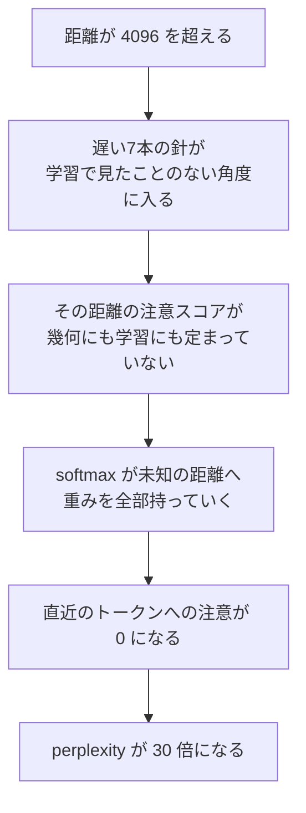

この記事を読むと、LLMが学習で見た長さを超えた瞬間に壊れる理由を、自分の手で測って説明できるようになります。壊れ方は「長くなるほどじわじわ悪くなる」ではなく、崖です。その崖がどこにあり、モデルの中で何が起きているのかを、位置ごとの perplexity と注意の重みの両方から特定します。

GPUは不要です。152Mパラメータのモデルと numpy をCPUで動かすだけで最後まで通ります。ただしCPUでの推論を4回まわすので、全部で5分ほどかかります。載せているコードは作図まで含んでいるので、上から順にコピペすると記事と同じ図が手元に出ます。

長い資料をまるごと貼り付けたら、それまで普通だった応答が急に的外れになった、という経験があると思います。よくある説明は「コンテキストウィンドウを超えたから」ですが、これは説明になっていません。超えたら**入らない**だけのはずで、入ったのに**壊れる**のはなぜなのか。そして、なぜ「だんだん」ではなく「急に」なのか。

この2つの問いには、位置エンコーディングの側にはっきりした答えがあります。しかもその答えは、波と周波数という物理の言葉でそのまま書けます。

## AIは長い文章のどこで急に壊れるのか

まず現象を測ります。設計はこうです。

- 8,192トークンの文章を**一度に**読ませる
- 位置ごとに「そこまで読んだ上で次の1トークンを当てる難しさ」を記録する
- その難しさが位置とともにどう変わるかを見る

指標には perplexity を使います。次のトークンの負の対数尤度（NLL）を指数に乗せた値で、「モデルが実質何択で迷っているか」と読めます。perplexity が100なら、100択で当てずっぽうをしているのと同じ不確かさということです。

モデルは前回・前々回と同じ [`llm-jp/llm-jp-3-150m`](https://huggingface.co/llm-jp/llm-jp-3-150m) を使います。日本語で学習された152Mパラメータの小さなモデルで、CPUで動きます。今回この選択が効いてくるのは、中身が `LlamaForCausalLM` だからです。つまり位置エンコーディングに RoPE（Rotary Position Embedding）が入っていて、学習時に見た最大の位置は4,096だとconfigに書いてあります。

テキストは青空文庫の[『吾輩は猫である』](https://www.aozora.gr.jp/cards/000148/card789.html)を使います。パブリックドメインで、8,192トークンの窓を取っても余るだけの長さがあります。

:::message
「`HF_TOKEN` へのアクセスを許可しますか？」というダイアログが出た場合は、キャンセルで問題ありません。今回使うモデルは誰でもダウンロードできる公開モデルなので、トークンは不要です。「未認証なのでダウンロード速度の制限が厳しめになる」という警告が出ることがありますが、エラーではありません。
:::

```python
try:
    import matplotlib_fontja  # noqa: F401
except ModuleNotFoundError:
    import subprocess, sys
    subprocess.check_call([sys.executable, "-m", "pip", "install", "-q", "matplotlib-fontja"])
    import matplotlib_fontja  # noqa: F401

import io
import re
import zipfile
import urllib.request
import numpy as np
import torch
import matplotlib.pyplot as plt
from transformers import AutoTokenizer, AutoModelForCausalLM

MODEL = "llm-jp/llm-jp-3-150m"
WINDOW = 8192          # 一度に読ませる長さ

tok = AutoTokenizer.from_pretrained(MODEL)
model = AutoModelForCausalLM.from_pretrained(MODEL)
model.eval()

TRAIN = model.config.max_position_embeddings   # 学習中に見た最大の位置
print(f"学習長 TRAIN = {TRAIN} / 読ませる長さ WINDOW = {WINDOW}")

# 青空文庫『吾輩は猫である』（パブリックドメイン）
URL = "https://www.aozora.gr.jp/cards/000148/files/789_ruby_5639.zip"
z = zipfile.ZipFile(io.BytesIO(urllib.request.urlopen(URL).read()))
raw = z.read(z.namelist()[0]).decode("shift_jis", errors="ignore")
text = re.sub(r"《[^》]*》", "", raw)          # ルビ
text = text.replace("｜", "")                 # ルビの開始記号
text = re.split(r"-{20,}", text)[-1]          # 冒頭の凡例ヘッダを落とす
text = re.sub(r"［＃[^］]*］", "", text)      # 入力者注記
text = re.sub(r"\n{2,}", "\n", text).strip()

ids = tok(text, return_tensors="pt").input_ids[0][:WINDOW].unsqueeze(0)

with torch.no_grad():                          # CPUで1分ほどかかる
    logits = model(ids).logits[0].float()

# 位置pのNLL = 「pまで読んだ上で、p+1番目のトークンを当てる難しさ」
nll = torch.nn.functional.cross_entropy(
    logits[:-1], ids[0][1:], reduction="none").numpy()

edges = [512, 1024, 2048, 3072, 4096, 5120, 6144, 7168, 8191]
print(f"\n{'位置':>15}{'perplexity':>13}")
for a, b in zip(edges[:-1], edges[1:]):
    mark = "  ← 学習長の外" if a >= TRAIN else ""
    print(f"{a:>6} - {b:<6}{np.exp(nll[a:b].mean()):>13.1f}{mark}")

W = 64                                          # 64トークンずつ平均してならす
pos = np.arange(0, len(nll) - W, W)
ppl = np.array([np.exp(nll[p:p + W].mean()) for p in pos])

fig, ax = plt.subplots(figsize=(10, 4.6))
ax.plot(pos, ppl, lw=1.2, color="#3b82f6")
ax.axvline(TRAIN, color="#d33", ls="--", lw=1.6)
ax.text(TRAIN * 1.02, ppl.max() * 0.6, f"学習長 {TRAIN}", color="#d33", fontsize=11)
ax.axvspan(TRAIN, WINDOW, color="#d33", alpha=.06)
ax.set_yscale("log")
ax.set_xlabel("文章中の位置（トークン）")
ax.set_ylabel("perplexity（対数軸）")
ax.set_title("学習長を1トークン超えたところで、予測が崖から落ちる")
ax.grid(alpha=.3)
fig.tight_layout()
plt.show()
```

```
学習長 TRAIN = 4096 / 読ませる長さ WINDOW = 8192

             位置   perplexity
   512 - 1024           75.8
  1024 - 2048           88.7
  2048 - 3072          120.1
  3072 - 4096          110.4
  4096 - 5120         1363.6  ← 学習長の外
  5120 - 6144         3357.3  ← 学習長の外
  6144 - 7168         3509.0  ← 学習長の外
  7168 - 8191         2396.6  ← 学習長の外
```


崖です。学習長の内側では perplexity が75から120のあいだで推移していて、位置が進んでもほとんど悪化していません。ところが4,096を超えた途端に1,363.6へ跳ね、さらに3,509.0まで上がります。直前の110.4に対して**32倍**です。

大事なのは、この崖が4,096という**特定の数字**の上に立っていることです。文章の内容が変わったわけでも、話題が難しくなったわけでもありません。同じ小説の続きを読んでいるだけです。変わったのは位置番号だけで、それだけで予測が壊れています。

### 効いている行

```python:抜粋
TRAIN = model.config.max_position_embeddings   # 学習中に見た最大の位置
nll = torch.nn.functional.cross_entropy(
    logits[:-1], ids[0][1:], reduction="none").numpy()
```

`reduction="none"` が今回の要です。ふつう言語モデルの評価では全位置のNLLを平均して1つの perplexity にしますが、それをやると崖が平均に溶けて見えなくなります。位置ごとの生のNLLを残すからこそ、劣化が「どこで」起きたかが特定できます。

`max_position_embeddings` は、RoPEを使うモデルでは「この長さまでしか入らない」というハード制限ではありません。RoPEは位置ごとの埋め込みテーブルを持たず、位置から角度をその場で計算するので、8,192を渡しても計算自体は素通りします。エラーは出ません。出ないのに壊れる、というのがこの記事の題材です。

## そもそも、なぜ位置を「回転」で表すのか

Transformerの注意機構それ自体は、単語の並び順を見ていません。[Attentionは結局、何を思い出しているのか](https://zenn.dev/m2yagyu/articles/attention-hopfield-associative-memory)で扱ったとおり、$\mathrm{softmax}(qK^\top/\sqrt{d})V$ は「問い合わせベクトルに似た鍵を探す」という連想記憶の想起則で、入力を並べ替えても結果は並べ替わるだけです。だから位置の情報は外から足してやる必要があります。

素朴なやり方は、位置番号ごとにベクトルを1本用意して足すことです（絶対位置埋め込み）。[Attention Is All You Need](https://arxiv.org/abs/1706.03762) の正弦波エンコーディングも、GPT-2の学習可能な位置埋め込みもこの系統です。ただしこれには弱点があります。位置5のベクトルと位置6のベクトルは、モデルにとって**別々の記号**でしかありません。「5と6は隣どうし」という関係は、学習を通じて間接的に覚えてもらうしかない。

[RoPE](https://arxiv.org/abs/2104.09864) の発想は、位置ベクトルを**足す**のをやめて、クエリとキーを位置に応じて**回す**ことです。

head_dim が64なら、64次元を2つずつ組にして32本のペアを作り、$j$ 番目のペアを位置 $m$ に応じて角度 $m\theta_j$ だけ回します。

$$
R(m) = \bigoplus_{j=0}^{31}
\begin{pmatrix}
\cos m\theta_j & -\sin m\theta_j \\
\sin m\theta_j & \cos m\theta_j
\end{pmatrix},
\qquad
\theta_j = \text{base}^{-2j/d}
$$

この式を絵で言うと、**速さの違う32本の針を持った時計**です。いちばん速い針は数トークンで1周し、いちばん遅い針はほとんど動かない。ある位置での「時刻」を、32本の針の向きの組み合わせで表している、と思ってください。

右辺の先頭にある $\bigoplus$ は行列の直和で、32個の $2\times2$ 回転行列を対角にブロックとして並べ、1つの $64\times64$ 行列にすることを表します。$\sum$ のように足し合わせるのではありません。$j$ 番目のブロックは自分の担当する2次元だけを回し、他のブロックとは干渉せず、ブロック以外の成分はすべてゼロです。32本の針がそれぞれ独立に回る、という上の絵は、この記号がそのまま言っていることです。

なお、この書き方は隣り合う次元どうし（$2j$ 番目と $2j+1$ 番目）を組ませる形になっていますが、これから使う Hugging Face の実装は $j$ 番目と $j+32$ 番目を組ませます。次元の並べ替えが違うだけで、以降の議論で効いてくる性質はどちらでも変わりません。この点はコードのところで改めて触れます。

まずこの回転を numpy で書いて、実際に手で回してみます。ペアの組み方は Hugging Face の Llama実装（[`modeling_llama.py`](https://github.com/huggingface/transformers/blob/main/src/transformers/models/llama/modeling_llama.py) の `rotate_half`）に合わせて、$j$ 番目の次元を $j+32$ 番目と組ませます。

```python
D = model.config.hidden_size // model.config.num_attention_heads
BASE = model.config.rope_scaling["rope_theta"]
theta = BASE ** (-np.arange(0, D, 2) / D)      # 32本の角速度
print(f"head_dim = {D} / base = {BASE:.0f} / ペア数 = {len(theta)}")


def rope(v, m):
    """位置 m の回転を head_dim 次元のベクトル v に適用する。
    HFのLlama実装と同じく、j番目の次元は j+D/2 番目とペアを組む"""
    x1, x2 = v[:D // 2], v[D // 2:]
    c, s = np.cos(m * theta), np.sin(m * theta)
    return np.concatenate([x1 * c - x2 * s, x1 * s + x2 * c])


rng = np.random.default_rng(0)
q, k = rng.normal(size=D), rng.normal(size=D)

print(f"\n{'クエリ位置 m':>12}{'キー位置 n':>12}{'距離 m-n':>10}{'内積':>18}")
for m, n in [(5, 3), (105, 103), (3000, 2998), (7000, 6998),
             (5, 0), (105, 100), (3000, 2995)]:
    print(f"{m:>12}{n:>12}{m - n:>10}{rope(q, m) @ rope(k, n):>18.10f}")

fig, axes = plt.subplots(1, 3, figsize=(12, 4.2))
circle = np.linspace(0, 2 * np.pi, 200)
for ax, j in zip(axes, [0, 16, 31]):
    ang = np.arange(0, 13) * theta[j]
    ax.plot(np.cos(circle), np.sin(circle), color="#dddddd", lw=1)
    ax.quiver(np.zeros(13), np.zeros(13), np.cos(ang), np.sin(ang),
              np.arange(13), cmap="viridis", scale=1, scale_units="xy",
              angles="xy", width=0.012)
    ax.set_title(f"ペア j={j}", fontsize=11)
    ax.text(0, -1.28, f"波長 {2 * np.pi / theta[j]:,.0f} トークン",
            ha="center", fontsize=10, color="#555")
    ax.set_xlim(-1.35, 1.35)
    ax.set_ylim(-1.5, 1.2)
    ax.set_aspect("equal")
    ax.axis("off")
fig.suptitle("位置0から12まで進むあいだに、各ペアが回る量（色が濃いほど後ろの位置）",
             fontsize=12, y=0.97)
fig.tight_layout()
fig.subplots_adjust(top=0.82)
plt.show()
```

```
head_dim = 64 / base = 10000 / ペア数 = 32

     クエリ位置 m      キー位置 n    距離 m-n                内積
           5           3         2    -10.5517582631
         105         103         2    -10.5517582631
        3000        2998         2    -10.5517582631
        7000        6998         2    -10.5517582631
           5           0         5     -9.0053751991
         105         100         5     -9.0053751991
        3000        2995         5     -9.0053751991
```


いちばん速いペアは12トークン進むあいだに2周近く回り、いちばん遅いペアは矢印が1本に重なって見えるほどしか動きません。同じ位置の変化を、32本の針がまったく違う速さで表現しています。

## 回転させただけで、なぜ相対位置だけが残るのか

上の出力の前半4行を見てください。

- $m=5, n=3$ の内積が $-10.5517582631$
- $m=7000, n=6998$ の内積も $-10.5517582631$

絶対位置が5と7,000で3桁違うのに、距離が同じ2であれば内積は小数10桁まで一致します。距離5の3行も同じです。

これがRoPEの狙いそのものです。回転行列は $R(m)^\top R(n) = R(n-m)$ を満たすので、

$$
\big(R(m)q\big)^\top \big(R(n)k\big)
= q^\top R(m)^\top R(n) k
= q^\top R(n-m) k
$$

となり、注意スコアに残るのは $n-m$、つまり**相対位置だけ**になります。絶対位置は途中で打ち消し合って消えます。位置1,000の「猫」と位置1,003の「が」の関係は、位置5,000と5,003に移しても同じ。並行移動しても関係が変わらないという、素直で強い性質です。

そしてここが今回の落とし穴でもあります。**内積に効くのは距離 $m-n$ だけ**なら、壊れる原因も距離の側にあるはずです。位置8,000そのものが特別なのではなく、そこで初めて現れる**距離**が特別なのではないか。

### 効いている行

```python:抜粋
x1, x2 = v[:D // 2], v[D // 2:]
c, s = np.cos(m * theta), np.sin(m * theta)
return np.concatenate([x1 * c - x2 * s, x1 * s + x2 * c])
```

上の数式の $2\times 2$ 回転行列を、32本ぶんまとめてベクトル演算で書いた形です。`x1 * c - x2 * s` が回転行列の1行目、`x1 * s + x2 * c` が2行目に対応します。

ここを間違えるとモデルの実装と合わなくなるのがペアの組み方です。数式だけ見ると隣り合う次元 $(v_0, v_1)$ を組ませたくなりますが、Hugging Faceの実装は前半32次元と後半32次元を組ませます（$v_0$ と $v_{32}$）。どちらでも「相対位置だけが残る」性質は保たれるので数学的には等価ですが、学習済み重みと突き合わせるときに混ぜると壊れます。

## 64次元の中で、時計は何本走っているのか

距離が怪しいと分かったので、32本の針の速さを具体的に見ます。$\theta_j = \text{base}^{-2j/d}$ は $j$ が大きいほど小さくなる等比数列で、base は10,000です。

```python
wl = 2 * np.pi / theta                     # 波長：何トークンで1周するか
turns = TRAIN * theta / (2 * np.pi)        # 学習長までに回る周数

print(f"{'ペア j':>7}{'角速度 θ':>12}{'波長(トークン)':>18}{'学習長までの回転':>18}")
for j in [0, 8, 16, 24, 28, 31]:
    print(f"{j:>7}{theta[j]:>12.3e}{wl[j]:>18,.1f}{turns[j]:>17.3f}周")
print(f"\n1周もしないペア : {int((turns < 1).sum()):>2}本 / {len(theta)}本")
print(f"半周も回らないペア: {int((turns < 0.5).sum()):>2}本 / {len(theta)}本")

fig, (a1, a2) = plt.subplots(1, 2, figsize=(12, 4.5))
a1.semilogy(range(len(wl)), wl, "o-", color="#3b82f6")
a1.axhline(TRAIN, color="#d33", ls="--", lw=1.4)
a1.text(0.3, TRAIN * 1.3, f"学習長 {TRAIN} トークン", color="#d33", fontsize=10)
a1.set_xlabel("ペア番号 j（右へ行くほど遅い）")
a1.set_ylabel("波長（トークン・対数軸）")
a1.set_title("32本の針は、6トークンで1周するものから\n47,000トークンかけて1周するものまである")
a1.grid(alpha=.3)

a2.bar(range(len(turns)), turns, color=np.where(turns < 0.5, "#d33", "#3b82f6"))
a2.set_yscale("log")
a2.axhline(0.5, color="#333", ls="--", lw=1.2)
a2.text(0.3, 0.57, "半周", fontsize=10)
a2.set_xlabel("ペア番号 j")
a2.set_ylabel("学習長までに回る周数（対数軸）")
a2.set_title(f"赤い{int((turns < 0.5).sum())}本は、学習中に半周も回っていない")
a2.grid(alpha=.3, axis="y")
fig.tight_layout()
plt.show()
```

```
   ペア j       角速度 θ          波長(トークン)          学習長までの回転
      0   1.000e+00               6.3          651.899周
      8   1.000e-01              62.8           65.190周
     16   1.000e-02             628.3            6.519周
     24   1.000e-03           6,283.2            0.652周
     28   3.162e-04          19,869.2            0.206周
     31   1.334e-04          47,117.2            0.087周

1周もしないペア :  9本 / 32本
半周も回らないペア:  7本 / 32本
```


いちばん速い針は6.3トークンで1周し、学習長までに652周します。いちばん遅い針の波長は47,117トークンで、学習長を走り切っても**0.087周**、角度にして31度しか進みません。

### なぜ波長を6トークンから47,000トークンまで散らすのか

これは設計としては意図どおりです。速い針は「隣か2つ先か」という細かい距離を区別するために、遅い針は「同じ段落か、ずっと前か」という粗い距離を区別するために置かれています。周波数を対数的に並べて、いろいろなスケールの距離を同時に表せるようにした、という位置エンコーディングの標準的な作りです。

問題は、遅い針が学習中に**自分の可動域のごく一部しか使っていない**ことです。

## 学習中に一度も見ていない角度とは何か

ここが崖の正体です。針が1周してしまえば、そのペアが取りうる値は全部出尽くしています。$\cos$ は $-1$ から $+1$ まで一巡していて、距離がさらに伸びても同じ値の繰り返しに入るだけです。モデルにとって未知の入力は現れません。

ところが半周も回っていない針は違います。$\cos(d\theta_j)$ は $d$ が伸びるあいだ単調に減り続けていて、学習で経験した範囲は $\cos$ の可動域の端の一部だけです。学習長を超えると、その針は**生まれて初めての値**をモデルに渡し始めます。

```python
d = np.arange(0, WINDOW + 1)

print(f"{'ペア j':>7}{'学習中に見た cos の範囲':>26}"
      f"{'距離8192での値':>18}{'学習中に見たか':>16}")
for j in [0, 16, 24, 28, 31]:
    seen = np.cos(d[:TRAIN + 1] * theta[j])
    far = np.cos(WINDOW * theta[j])
    inside = seen.min() <= far <= seen.max()
    print(f"{j:>7}   [{seen.min():+.3f}, {seen.max():+.3f}]{far:>18.3f}"
          f"{('見た' if inside else '一度もない'):>16}")

fig, (a1, a2) = plt.subplots(1, 2, figsize=(12.5, 4.6))
for j, col in [(16, "#3b82f6"), (24, "#f59e0b"), (31, "#d33")]:
    a1.plot(d, np.cos(d * theta[j]), color=col, lw=1.2,
            label=f"ペア j={j}（波長 {2 * np.pi / theta[j]:,.0f}）")
a1.axvspan(TRAIN, WINDOW, color="#d33", alpha=.08)
a1.axvline(TRAIN, color="#d33", ls="--", lw=1.4)
a1.text(TRAIN * 1.03, -1.42, "ここから先は学習で見ていない", color="#d33", fontsize=10)
a1.set_xlabel("クエリとキーの距離 m−n（トークン）")
a1.set_ylabel("そのペアが内積に足す量 cos((m−n)θ)")
a1.set_title("速い針は往復するだけ。遅い針は片道で出ていく\n（j=0 は波長6.3で密すぎるため省いた）", fontsize=11)
a1.set_ylim(-1.6, 1.3)
a1.legend(fontsize=9, loc="upper right")
a1.grid(alpha=.3)

t = np.linspace(0, 2 * np.pi, 400)
for cx, j, note in [(-1.25, 16, "6.5周して円を覆い尽くした"),
                    (1.25, 31, "31度しか見ていない")]:
    a2.plot(cx + np.cos(t), np.sin(t), color="#e8e8e8", lw=1)
    seen = min(TRAIN * theta[j], 2 * np.pi)          # 1周したら全部見たのと同じ
    s1 = np.linspace(0, seen, 300)
    a2.plot(cx + np.cos(s1), np.sin(s1), color="#3b82f6", lw=6, solid_capstyle="butt")
    if seen < 2 * np.pi:                              # 未踏の角度が残っている場合だけ赤を描く
        s2 = np.linspace(seen, min(WINDOW * theta[j], 2 * np.pi), 300)
        a2.plot(cx + np.cos(s2), np.sin(s2), color="#d33", lw=6, solid_capstyle="butt")
    a2.text(cx, 1.22, f"ペア j={j}", ha="center", fontsize=11)
    a2.text(cx, -1.42, note, ha="center", fontsize=10, color="#555")
a2.set_xlim(-2.6, 2.6)
a2.set_ylim(-1.7, 1.5)
a2.set_aspect("equal")
a2.axis("off")
a2.set_title("青＝学習中に見た角度　赤＝4096を超えて初めて入る角度", fontsize=11)
fig.tight_layout()
plt.show()
```

```
   ペア j            学習中に見た cos の範囲         距離8192での値         学習中に見たか
      0   [-1.000, +1.000]             0.293              見た
     16   [-1.000, +1.000]             0.972              見た
     24   [-1.000, +1.000]            -0.332              見た
     28   [+0.272, +1.000]            -0.852           一度もない
     31   [+0.854, +1.000]             0.460           一度もない
```


数字がはっきり出ました。

ペア j=31 が学習中に経験した $\cos$ の値は $[+0.854, +1.000]$ の範囲だけです。可動域 $[-1, +1]$ のうち、たった7%しか使っていません。距離8,192ではこの値が $+0.460$ になります。学習中に**一度も渡されたことのない入力**です。

ペア j=28 はもっと極端で、学習中は $[+0.272, +1.000]$ しか見ていないのに、距離8,192では $-0.852$ まで振れます。符号が反転しています。

一方で j=0、j=16、j=24 はすべて「見た」です。これらは学習長までに半周以上回っているので、遠い距離で出てくる値も学習中のどこかで既に出会っています。

### 未知の値を渡しているのは、32本のうち7本だけ

つまり崖の候補はこう言い換えられます。**注意スコアに入る32個の成分のうち、7個だけが学習長の外で未知の値に化ける。** 残り25個は既知の値の繰り返しです。

これは「長くなるほど情報が薄まる」のような連続的な劣化ではありません。距離が4,096を1つ超えた瞬間に、7本の針が学習データの外へ出ます。崖が急なのはそのためです。

## 壊れているのは注意の向き先なのか、分布そのものなのか

ここまでは入力側の話でした。では実際のモデルの中で、この未知の値は何を引き起こしているのか。

注意機構の中を直接のぞきます。中間層のひとつにフックを掛けて隠れ状態を捕まえ、そこから自分の手でクエリとキーを作り、RoPEを掛けて、注意の重みを再構成します。`output_attentions=True` を使わないのは、8,192×8,192の注意行列を12層ぶん保持するとメモリが数十GBになるからです。1層ぶんの隠れ状態だけ取り出せば、必要な行だけ後から計算できます。

見るのは2つの量です。

- **直近64トークンへの注意の重み**：モデルがすぐ手前の文脈をちゃんと見ているか
- **距離4,096を超えたキーへの注意の重み**：学習で見たことのない距離にどれだけ吸われているか

```python
import math
from transformers.models.llama.modeling_llama import apply_rotary_pos_emb

LAYER, H = 6, model.config.num_attention_heads
attn = model.model.layers[LAYER].self_attn

captured = {}
hook = attn.register_forward_pre_hook(
    lambda mod, args, kw: captured.__setitem__(
        "h", kw.get("hidden_states", args[0] if args else None)),
    with_kwargs=True)
with torch.no_grad():                          # CPUで1分ほどかかる
    model(ids)
hook.remove()
hs = captured["h"]

with torch.no_grad():
    q = attn.q_proj(hs).view(1, -1, H, D).transpose(1, 2)
    k = attn.k_proj(hs).view(1, -1, H, D).transpose(1, 2)
    cos, sin = model.model.rotary_emb(hs, torch.arange(hs.shape[1]).unsqueeze(0))
    q, k = apply_rotary_pos_emb(q, k, cos, sin)
    q, k = q[0].float(), k[0].float()           # (ヘッド数, 位置, head_dim)


def attn_row(p):
    """位置pのクエリが、0..pのキーに配る重み（ヘッドで平均する前）"""
    lg = (q[:, p:p + 1] * k[:, :p + 1]).sum(-1) / math.sqrt(D)
    return torch.softmax(lg, dim=-1)


PROBE = np.arange(512, WINDOW, 128)
local = np.array([float(attn_row(int(p))[:, int(p) - 63:int(p) + 1].sum(-1).mean())
                  for p in PROBE])
beyond = np.array([float(attn_row(int(p))[:, :max(0, int(p) - TRAIN)].sum(-1).mean())
                   for p in PROBE])

print(f"{'クエリ位置':>10}{'直近64への重み':>16}{'距離4096超への重み':>20}")
for p in [3584, 3968, 4096, 4224, 4352, 5120, 6144, 7936]:
    i = int(np.where(PROBE == p)[0][0])
    print(f"{p:>10}{local[i]:>16.4f}{beyond[i]:>20.4f}")

fig, (a1, a2) = plt.subplots(1, 2, figsize=(12.5, 4.5))
a1.plot(PROBE, local, color="#3b82f6", lw=1.4)
a1.axvline(TRAIN, color="#d33", ls="--", lw=1.5)
a1.axvspan(TRAIN, WINDOW, color="#d33", alpha=.06)
a1.set_xlabel("クエリ位置")
a1.set_ylabel("直近64トークンに配る注意の重み")
a1.set_title("学習長を越えると、すぐ隣の単語を見なくなる")
a1.grid(alpha=.3)

a2.plot(PROBE, beyond, color="#d33", lw=1.4)
a2.axvline(TRAIN, color="#d33", ls="--", lw=1.5)
a2.set_xlabel("クエリ位置")
a2.set_ylabel("距離4096超のキーに配る注意の重み")
a2.set_title("注意はまるごと、学習で見たことのない距離へ吸い込まれる")
a2.grid(alpha=.3)
fig.tight_layout()
plt.show()
```

```
     クエリ位置        直近64への重み         距離4096超への重み
      3584          0.3788              0.0000
      3968          0.3900              0.0000
      4096          0.4107              0.0000
      4224          0.3302              0.4946
      4352          0.1259              0.7356
      5120          0.0051              0.9715
      6144          0.0008              0.9956
      7936          0.0014              0.9981
```


これは予想より激しい壊れ方でした。

位置4,096までは、モデルは直近64トークンに注意の37〜41%を配っています。日本語の次の1トークンを当てるのですから当然の振る舞いです。ところが位置4,224、**距離4,096を超えたキーが現れて最初の測定点**で、注意の49.5%がもうそちらへ移っています。位置4,352で73.6%、位置5,120で97.2%、位置7,936では**99.8%**です。

同時に直近64トークンへの重みは 0.4107 → 0.0051 → 0.0014 と、実質ゼロまで落ちます。モデルはすぐ手前の単語をほぼ完全に見捨てて、学習で一度も経験したことのない距離にあるトークンだけを見ています。これでは次の1トークンが当たるはずがありません。perplexity が32倍になるのは、この結果です。

答えははっきりしました。壊れているのは**注意の向き先**です。出力分布が薄くぼやけるのではなく、注意が使い物にならない場所へ丸ごと引っ越しています。

### 効いている行

```python:抜粋
lg = (q[:, p:p + 1] * k[:, :p + 1]).sum(-1) / math.sqrt(D)
```

`p:p+1` とスライスしてサイズ1の軸を残すのが要です。`q[:, p]` と書くと形が `(ヘッド数, head_dim)` になり、`k[:, :p+1]` の `(ヘッド数, 位置, head_dim)` とブロードキャストしたときにヘッド軸と位置軸が取り違えられて、誤差ではなく**別の量**が静かに計算されます。最初にこれをやって、注意エントロピーがそれらしい値で出てしまい、崩壊を見落としました。行列積で書かずに要素積＋`sum` で書いているのは、`(位置, head_dim)` を保ったまま因果マスクを「スライスで切る」だけで済ませるためです。

```python:抜粋
hook = attn.register_forward_pre_hook(
    lambda mod, args, kw: captured.__setitem__(
        "h", kw.get("hidden_states", args[0] if args else None)),
    with_kwargs=True)
```

`self_attn` の**入力**を捕まえています。出力ではありません。入力の隠れ状態さえあれば、そのモジュール自身の `q_proj` / `k_proj` と `model.model.rotary_emb` を借りて、注意行列の任意の1行を後から再現できます。全層ぶんの注意行列を保持する代わりに、512次元×8,192位置の1テンソルだけで済みます。

## 遠いトークンは、なぜ勝ててしまうのか

ここで疑問が残ります。RoPEには「遠いほど注意スコアが下がる」性質（long-term decay）があると説明されることが多い。それが本当なら、距離5,000のトークンは距離3のトークンに勝てないはずです。

その性質がどこまで本物か、numpyだけで確かめられます。クエリとキーが同じ向きを向いている理想的な場合、注意スコアに残るのは $\sum_j \cos(d\theta_j)$ です。これがRoPEに内蔵された素の距離カーネルで、学習した重みは一切入っていません。

```python
d_all = np.arange(0, WINDOW + 1)
kernel = np.cos(d_all[:, None] * theta[None, :]).sum(1)

print(f"{'距離 d':>9}{'カーネル値':>13}")
for x in [0, 1, 4, 16, 64, 256, 1024, 2048, 4096, 6144, 8192]:
    print(f"{x:>9}{kernel[x]:>13.2f}")
print(f"\nd>=512 での最大 {kernel[512:].max():.2f} / 最小 {kernel[512:].min():.2f}")
print(f"d=6144 の値 {kernel[6144]:.2f} は d=2048 の値 {kernel[2048]:.2f} より高い")

M = 129                                            # 移動平均の窓
smooth = np.convolve(kernel, np.ones(M) / M, mode="valid")

fig, ax = plt.subplots(figsize=(10, 4.4))
ax.plot(d_all, kernel, lw=0.7, color="#9ec5fb")
ax.plot(d_all[M // 2:-(M // 2)], smooth, lw=2.0, color="#1d4ed8", label="移動平均")
ax.axhline(0, color="#999", lw=0.8)
ax.legend(fontsize=9, loc="upper right")
ax.axvline(TRAIN, color="#d33", ls="--", lw=1.5)
ax.axvspan(512, WINDOW, color="#f59e0b", alpha=.07)
ax.text(1200, kernel.max() * 0.82,
        "この帯の中では、距離が10倍違っても\nカーネルは同じくらいの値を取る",
        fontsize=10, color="#8a5a00")
ax.set_xlabel("クエリとキーの距離 d")
ax.set_ylabel(r"素の距離カーネル $\sum_j \cos(d\theta_j)$")
ax.set_title("RoPEの「遠いほど弱く」は数百トークンまでしか効かない")
ax.grid(alpha=.3)
fig.tight_layout()
plt.show()
```

```
    距離 d        カーネル値
        0        32.00
        1        30.92
        4        23.93
       16        19.37
       64        13.91
      256        11.32
     1024         8.41
     2048        -1.27
     4096         0.11
     6144         3.07
     8192         2.51

d>=512 での最大 13.25 / 最小 -9.92
d=6144 の値 3.07 は d=2048 の値 -1.27 より高い
```


減衰しているのは最初の数百トークンだけでした。距離0で32、距離256で11.3まで落ちますが、そこから先は $-9.9$ から $+13.3$ のあいだを行ったり来たりするだけです。距離6,144のカーネル値3.07は、距離2,048の $-1.27$ **より高い**。

つまりRoPEの幾何そのものには、「5,000トークン前より3トークン前を優先せよ」という情報が入っていません。長距離での順位付けは、100%学習が担っています。そして学習は4,096で止まっています。

これで筋が通りました。

1. 距離が4,096を超えると、7本の遅い針が未知の値をモデルに渡す
2. その距離の注意スコアがどうあるべきかは、幾何にも学習にも書かれていない
3. たまたま高いスコアが出れば、softmax はそこへ重みを全部持っていく
4. 直近の単語への注意がゼロになり、予測が崩れる



崖が急なのは1が急だからで、落ちた先が深いのは2で歯止めがないからです。

## 位置を縮めれば直るのか

原因が「未知の角度に出ること」なら、対策は「角度を既知の範囲に押し込めること」です。いちばん素直なやり方が [Position Interpolation](https://arxiv.org/abs/2306.15595)（PI）で、位置番号そのものを縮めます。8,192まで使いたいなら位置を半分にして、モデルから見た位置は4,096までに収める。針は学習中に見た角度しか経験しません。

Hugging Face では `rope_scaling` に `{"rope_type": "linear", "factor": 2.0}` を渡すだけで切り替わります。以降で2つの設定を測るので、測定を関数にまとめます。

```python
from transformers import AutoConfig


def measure(scaling):
    """rope_scaling を差し替えたモデルで、位置ごとのNLLと
    直近64トークンへの注意の重みを測る（CPUで1分ほどかかる）"""
    cfg = AutoConfig.from_pretrained(MODEL)
    cfg.rope_scaling = scaling
    m = AutoModelForCausalLM.from_pretrained(MODEL, config=cfg)
    m.eval()
    at = m.model.layers[LAYER].self_attn
    box = {}
    hk = at.register_forward_pre_hook(
        lambda mod, args, kw: box.__setitem__(
            "h", kw.get("hidden_states", args[0] if args else None)),
        with_kwargs=True)
    with torch.no_grad():
        lg = m(ids).logits[0].float()
    hk.remove()
    n = torch.nn.functional.cross_entropy(
        lg[:-1], ids[0][1:], reduction="none").numpy()
    h2 = box["h"]
    with torch.no_grad():
        qq = at.q_proj(h2).view(1, -1, H, D).transpose(1, 2)
        kk = at.k_proj(h2).view(1, -1, H, D).transpose(1, 2)
        c2, s2 = m.model.rotary_emb(h2, torch.arange(h2.shape[1]).unsqueeze(0))
        qq, kk = apply_rotary_pos_emb(qq, kk, c2, s2)
        qq, kk = qq[0].float(), kk[0].float()
        lo = []
        for p in PROBE:
            p = int(p)
            a = torch.softmax((qq[:, p:p + 1] * kk[:, :p + 1]).sum(-1) / math.sqrt(D), -1)
            lo.append(float(a[:, p - 63:p + 1].sum(-1).mean()))
    return n, np.array(lo)


nll_pi, local_pi = measure({"rope_theta": BASE, "rope_type": "linear", "factor": 2.0})


def band(x):
    return np.exp(x[512:TRAIN].mean()), np.exp(x[TRAIN:WINDOW - 1].mean())


print(f"{'設定':<16}{'学習長内 ppl':>14}{'学習長外 ppl':>14}")
for tag, x in [("そのまま", nll), ("PI（位置を半分に）", nll_pi)]:
    a, b = band(x)
    print(f"{tag:<16}{a:>14.2f}{b:>14.2f}")

fig, ax = plt.subplots(figsize=(10, 4.6))
for x, col, lab in [(nll, "#3b82f6", "そのまま"), (nll_pi, "#16a34a", "PI（位置を半分に）")]:
    ax.plot(pos, [np.exp(x[p:p + W].mean()) for p in pos], lw=1.2, color=col, label=lab)
ax.axvline(TRAIN, color="#d33", ls="--", lw=1.5)
ax.set_yscale("log")
ax.set_xlabel("文章中の位置（トークン）")
ax.set_ylabel("perplexity（対数軸）")
ax.set_title("崖は消えた。ただし学習長の内側も一段悪くなっている")
ax.legend()
ax.grid(alpha=.3)
fig.tight_layout()
plt.show()
```

```
設定                    学習長内 ppl      学習長外 ppl
そのまま                    100.67       2490.95
PI（位置を半分に）              231.38        255.77
```


崖は消えました。学習長の外の perplexity が2,491から256へ、10分の1以下です。

しかしタダではありません。学習長の**内側**が100.7から231.4へ、2.3倍悪化しています。位置を半分に縮めるということは、隣り合うトークンの角度差も半分になるということです。速い針が「隣か2つ先か」を見分けるために持っていた分解能を、その場で捨てています。長い文章を扱えるようにした代わりに、短い文章も下手になった。

追加学習（ファインチューニング）を挟めばこの劣化はかなり取り戻せる、というのがPIの論文の主張ですが、ここでやっているのは重みを一切触らない差し替えなので、代償がそのまま出ています。

## 高い周波数はそのままに、低いほうだけ伸ばせないか

PIの損は、**全部の針を等しく縮めた**ことから来ています。しかし未知の角度に出ていたのは遅い7本だけでした。速い針は学習中に何百周もしていて、何も困っていない。困っていない針まで縮めたから、短距離の分解能を失いました。

だったら周波数ごとに扱いを変えればよい。速い針はそのまま、遅い針だけ引き伸ばす。これが [NTK-aware scaling](https://www.reddit.com/r/LocalLLaMA/comments/14lz7j5/ntkaware_scaled_rope_allows_llama_models_to_have/) の発想で、位置ではなく base を大きくすることで実現します。$\theta_j = \text{base}^{-2j/d}$ で base を上げると、$j$ が小さい速い針はほとんど変わらず、$j$ が大きい遅い針ほど大きく遅くなります。この考えを詰めたものが [YaRN](https://arxiv.org/abs/2309.00071) で、いま長文対応モデルの多くが採用しています。

まず、base を変えると32本の針の速さがどう変わるかだけ先に見ておきます。

```python
fig, ax = plt.subplots(figsize=(9.5, 4.4))
for b, col, lab in [(BASE, "#3b82f6", f"base = {BASE:,.0f}（そのまま）"),
                    (BASE * 8, "#9333ea", f"base = {BASE * 8:,.0f}（NTK的に拡大）")]:
    th = b ** (-np.arange(0, D, 2) / D)
    ax.semilogy(range(len(th)), 2 * np.pi / th, "o-", color=col, lw=1.4, ms=4, label=lab)
th_pi = theta / 2.0                                   # PIは全部の針を一律に半分の速さにする
ax.semilogy(range(len(th_pi)), 2 * np.pi / th_pi, "s--", color="#16a34a",
            lw=1.4, ms=4, label="PI（全部の針を一律に半減）")
ax.axhline(TRAIN, color="#d33", ls="--", lw=1.3)
ax.text(0.3, TRAIN * 1.3, f"学習長 {TRAIN}", color="#d33", fontsize=10)
ax.set_xlabel("ペア番号 j（右へ行くほど遅い）")
ax.set_ylabel("波長（トークン・対数軸）")
ax.set_title("PIは全部を持ち上げる。base拡大は遅い針ほど大きく持ち上げる")
ax.legend(fontsize=9)
ax.grid(alpha=.3)
fig.tight_layout()
plt.show()
```


緑の破線（PI）は全部のペアを同じだけ上へずらしています。速い針の波長6.3が12.6になる、つまり隣り合うトークンの区別が半分に粗くなるということです。紫（base拡大）は左端がほとんど動かず、右へ行くほど大きく持ち上がります。困っていない針は触らない、という差がそのまま出ています。

Hugging Face の `"rope_type": "dynamic"` がこの base 拡大版です。

```python
nll_ntk, local_ntk = measure({"rope_theta": BASE, "rope_type": "dynamic", "factor": 2.0})

print(f"{'設定':<20}{'学習長内 ppl':>14}{'学習長外 ppl':>14}"
      f"{'直近64@3072':>14}{'直近64@6144':>14}")
i3 = int(np.argmin(abs(PROBE - 3072)))
i6 = int(np.argmin(abs(PROBE - 6144)))
for tag, x, lo in [("そのまま", nll, local),
                   ("PI（位置を半分に）", nll_pi, local_pi),
                   ("NTK（baseを拡大）", nll_ntk, local_ntk)]:
    a, b = band(x)
    print(f"{tag:<20}{a:>14.2f}{b:>14.2f}{lo[i3]:>14.3f}{lo[i6]:>14.3f}")

fig, (a1, a2) = plt.subplots(1, 2, figsize=(12.5, 4.6))
series = [(nll, local, "#3b82f6", "そのまま"),
          (nll_pi, local_pi, "#16a34a", "PI（位置を半分に）"),
          (nll_ntk, local_ntk, "#9333ea", "NTK（baseを拡大）")]
for x, lo, col, lab in series:
    a1.plot(pos, [np.exp(x[p:p + W].mean()) for p in pos], lw=1.2, color=col, label=lab)
a1.axvline(TRAIN, color="#d33", ls="--", lw=1.5)
a1.set_yscale("log")
a1.set_xlabel("文章中の位置（トークン）")
a1.set_ylabel("perplexity（対数軸）")
a1.set_title("学習長の内も外も保てているのはどれか")
a1.legend(fontsize=9)
a1.grid(alpha=.3)

for x, lo, col, lab in series:
    a2.plot(PROBE, lo, lw=1.4, color=col, label=lab)
a2.axvline(TRAIN, color="#d33", ls="--", lw=1.5)
a2.set_xlabel("クエリ位置")
a2.set_ylabel("直近64トークンに配る注意の重み")
a2.set_title("どちらの手当ても、隣を見る力を取り戻している")
a2.legend(fontsize=9)
a2.grid(alpha=.3)
fig.tight_layout()
plt.show()
```

```
設定                        学習長内 ppl      学習長外 ppl     直近64@3072     直近64@6144
そのまま                        100.67       2490.95         0.315         0.001
PI（位置を半分に）                  231.38        255.77         0.340         0.238
NTK（baseを拡大）                119.49        148.86         0.370         0.269
```


狙いどおりでした。

NTKは学習長の外の perplexity を2,491から148.9へ、PIよりさらに下げています。16分の1です。そのうえで学習長の内側の劣化は100.7から119.5、2割弱で済んでいます。PIの2.3倍悪化とは比較になりません。周波数ごとに扱いを変えたぶんだけ、失うものが減っています。

### 重みを1バイトも変えずに、隣を見る力が戻る

右の図がいちばんはっきりしています。手当てなしの青は位置4,096で直近への注意が0.001まで落ちたきりですが、緑は0.238、紫は0.269を学習長の外でも保っています。**距離を既知の角度に押し込めれば、モデルは隣を見る力を自分で取り戻す。** 重みは1バイトも変えていません。壊れていたのは知識ではなく、位置の渡し方だけだったということです。

## まとめ

長い文章を貼ったときにLLMが急に馬鹿になる現象を、152Mのモデル1つで最後まで追いかけました。

- 劣化は連続的ではなく崖で、学習長4,096ちょうどに立っている。perplexity は110.4から1,363.6へ跳ね、ピークでは3,509.0まで上がる（32倍）
- RoPEは位置を32本の異なる速さの針で表す。内積には相対位置だけが残る（距離が同じなら位置5でも7,000でも小数10桁まで一致する）
- 針の波長は6.3トークンから47,117トークンまで対数的に散らばっていて、遅い7本は学習長までに半周も回らない。その7本だけが、学習長の外で未知の値をモデルに渡す
- 実際に壊れているのは注意の向き先だった。位置7,936では注意の99.8%が距離4,096超のキーへ吸い込まれ、直近64トークンへの重みは0.0014まで落ちる
- RoPEの素の距離カーネルは数百トークンまでしか減衰しない。長距離の順位付けは幾何ではなく学習が担っていて、その学習が4,096で止まっている
- 位置を縮める（PI）と崖は消えるが、学習長の内側が2.3倍悪化する。base を拡大する（NTK-aware）と、内側の劣化を2割弱に抑えたまま外側を16分の1にできる。どちらも重みは1バイトも変えていない

最後の対比が、この題材でいちばん物理的なところです。PIとNTKの違いは「全部の周波数を一律に扱うか、周波数ごとに扱いを変えるか」だけで、それが性能の差にそのまま出ます。信号を周波数に分解して、帯域ごとに違う処理をする。位置エンコーディングの話をしていたつもりが、いつのまにか信号処理の話になっています。

そしてこの記事の測定はすべて、重みを1バイトも変えずに行いました。壊れていたのはモデルが覚えた知識ではなく、位置という入力の渡し方だけです。長文で応答が崩れるのを見たとき、「モデルが混乱している」と考えたくなりますが、実際に起きているのはもっと機械的なことでした。

## 参考

1. [RoFormer: Enhanced Transformer with Rotary Position Embedding](https://arxiv.org/abs/2104.09864) — RoPEの原論文。相対位置が残ることの導出と long-term decay の議論
2. [Extending Context Window of Large Language Models via Positional Interpolation](https://arxiv.org/abs/2306.15595) — Position Interpolation。この記事の `rope_type: "linear"`
3. [NTK-Aware Scaled RoPE](https://www.reddit.com/r/LocalLLaMA/comments/14lz7j5/ntkaware_scaled_rope_allows_llama_models_to_have/) — base を拡大する発想が最初に出た投稿
4. [YaRN: Efficient Context Window Extension of Large Language Models](https://arxiv.org/abs/2309.00071) — NTK-aware を周波数帯ごとに整理した手法
5. [LongRoPE: Extending LLM Context Window Beyond 2 Million Tokens](https://arxiv.org/abs/2402.13753) — 周波数ごとのスケール係数を探索で決める
6. [Attention Is All You Need](https://arxiv.org/abs/1706.03762) — 正弦波による絶対位置エンコーディング
7. [Efficient Streaming Language Models with Attention Sinks](https://arxiv.org/abs/2309.17453) — 長文で注意が特定位置へ吸われる現象の別の側面
8. [Lost in the Middle: How Language Models Use Long Contexts](https://arxiv.org/abs/2307.03172) — 学習長の内側でも位置によって使われ方が違うという話
9. [`modeling_llama.py`](https://github.com/huggingface/transformers/blob/main/src/transformers/models/llama/modeling_llama.py) — `rotate_half` と `apply_rotary_pos_emb` の実装
10. [`modeling_rope_utils.py`](https://github.com/huggingface/transformers/blob/main/src/transformers/modeling_rope_utils.py) — `linear` / `dynamic` などの `rope_scaling` がどう計算されているか
11. [llm-jp/llm-jp-3-150m](https://huggingface.co/llm-jp/llm-jp-3-150m) — この記事で使ったモデル
12. [青空文庫『吾輩は猫である』](https://www.aozora.gr.jp/cards/000148/card789.html) — 測定に使ったテキスト
13. [matplotlib-fontja](https://github.com/ciffelia/matplotlib-fontja) — matplotlibの日本語表示
14. [Attentionは結局、何を思い出しているのか](https://zenn.dev/m2yagyu/articles/attention-hopfield-associative-memory) — 注意機構そのものを連想記憶として読む回
15. [ブラジルの首都をAIに聞くと、なぜ自信満々で間違えるのか](https://zenn.dev/m2yagyu/articles/llm-hallucination-confidence) — 同じモデルで、確信度が正しさの物差しにならないことを測った回
16. [LLMのtemperatureは本当に温度だった](https://zenn.dev/m2yagyu/articles/llm-temperature-boltzmann) — softmaxとボルツマン分布の対応
