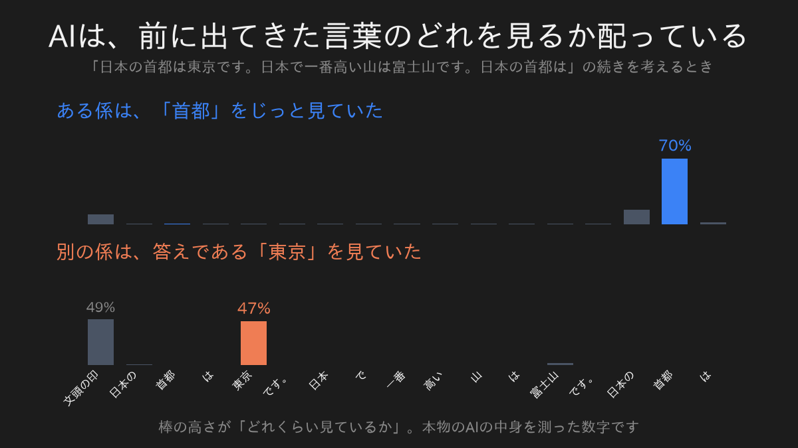
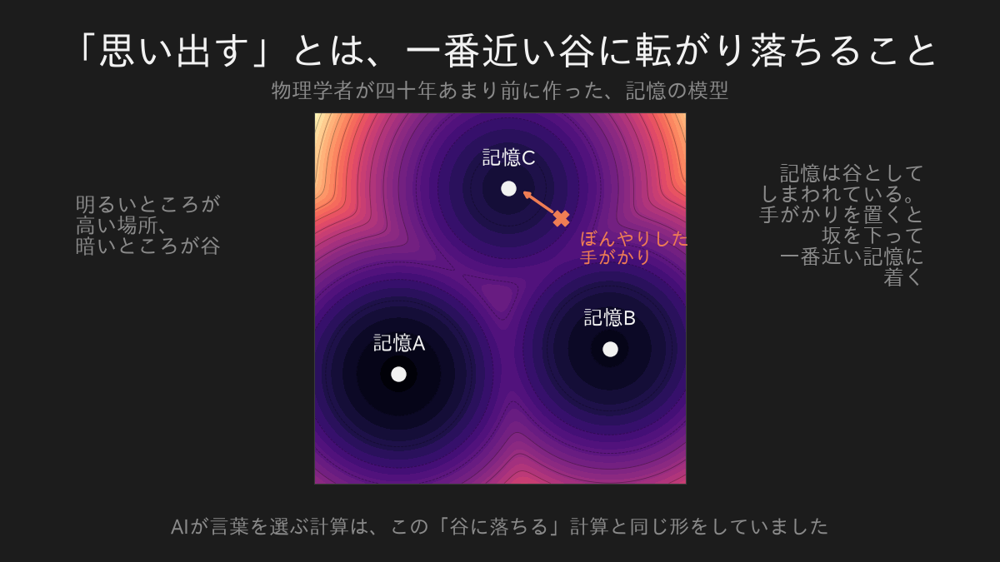
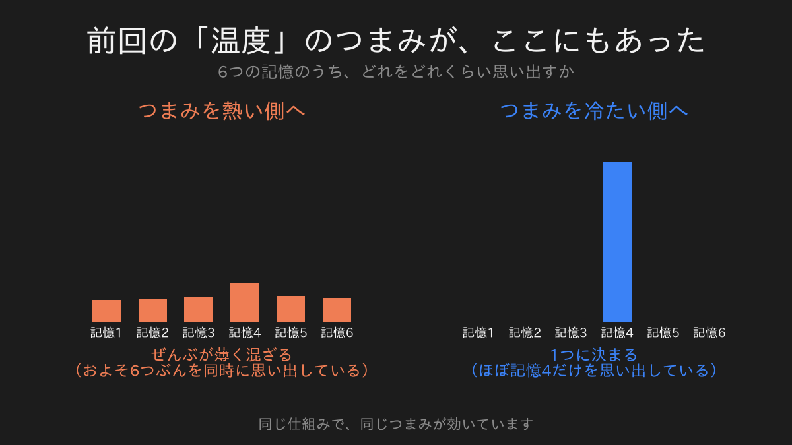
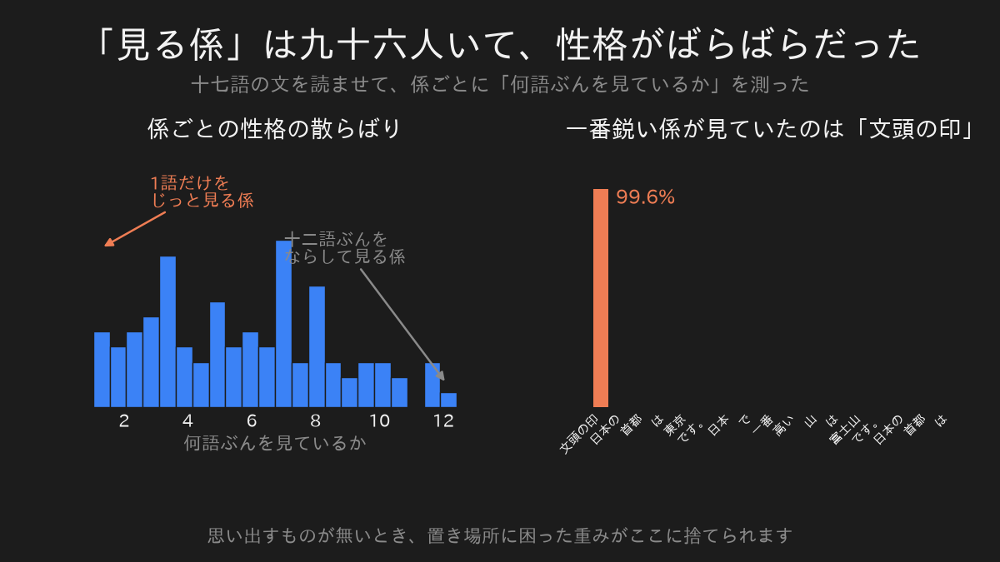

私は、人の名前が出てこないことがあります。

顔は浮かんでいる。

どこで会ったかも分かる。

なのに、名前だけが出てこない。

そういうとき、私は関係のありそうなことを手当たり次第に思い浮かべます。

あの会議、あの部署、あの人の隣にいた人。

そうしているうちに、ふっと名前が出てきます。

前回、AIが次の言葉をくじ引きで選んでいる、という話を書きました。

そのくじの偏りを決めているのが「温度」で、それが物理の温度と同じものだった、という話です。

今回はその続きです。

## 引っかかっていたこと

AIは、次の言葉を選んでいる。

そこまでは分かりました。

でも、選ぶには材料が要ります。

長い文章を読ませたとき、AIは前に出てきた言葉のどれを材料にしているのか。

全部を平等に見ているのか、それとも選んでいるのか。

そこが分かりませんでした。

## 覗いてみたら、ちゃんと選んでいた

こういう文をAIに読ませました。

「日本の首都は東京です。日本で一番高い山は富士山です。日本の首都は」

この続きを考えるとき、AIが前の言葉をどれくらい見ているかを測りました。

結果がこれです。

上の段は、「首都」という言葉に七割を置いていました。

下の段は別の担当で、こちらは「東京」に約半分を置いています。

平等に見ているわけではありませんでした。

前に出てきた言葉の中から、いま必要なものを選んで見ている。

私が名前を思い出すときにやっていることと、あまり変わりません。

## この計算には、すでに名前がついていた

ここからが本題です。

「手がかりを渡すと、それに近いものを引っ張り出してくる」

こういう装置は、AIより四十年ほど前に作られていました。

作ったのは物理学者です。

磁石の中の性質を計算する道具を、そのまま記憶の模型として読み替えました。

その模型では、記憶は「谷」としてしまわれています。

ぼんやりした手がかりを地面に置くと、坂を下って、一番近い谷に落ちる。

落ちた先が、思い出した記憶です。

手がかりが多少ずれていても、同じ谷に落ちるので、同じ記憶が戻ってきます。

思い出すという行為が、転がり落ちるという物理の言葉で書かれている。

私はここが面白いと思いました。

## そして、同じ式だった

驚いたのはこの先です。

いまのAIが「前の言葉のどれを見るか」を決める計算と、この谷に落ちる計算は、同じ形をしていました。

似ているのではありません。

並べて計算すると、答えのずれはゼロでした。

AIは文章を読むたびに、記憶を思い出す装置を動かしていたことになります。

## 前回のつまみが、ここにもあった

しかも、あのつまみが同じ場所にありました。

温度です。

温度を上げると、六つの記憶がぜんぶ薄く混ざります。

どれを思い出したのか決まらない。

温度を下げると、一つに絞られます。

前回は「次の言葉が決まるか、ばらけるか」のつまみでした。

今回は「記憶を一つ思い出すか、ぜんぶ混ぜるか」のつまみです。

別の場所の話に見えて、同じ一本のつまみでした。

## 中には九十六人の係がいた

実物のAIを覗いてみます。

小さめのAIでも、この「どこを見るか」を決める係が九十六人います。

全員が同じやり方で見ているのだろうと思っていました。

違いました。

一語だけをじっと見ている係と、十二語ぶんをならして見ている係が、同じAIの中に同居していました。

前者は、一つの記憶をくっきり思い出している。

後者は、全体の雰囲気をぼんやり眺めている。

同じ仕組みなのに、係ごとに温度が違っていました。

## いちばん不思議だったこと

一番鋭い係、つまり一番くっきり思い出している係が、何を見ているのかを調べました。

上位十人を並べたら、十人全員が同じものを見ていました。

文の先頭に付いている、内容のない印です。

言葉ですらありません。

これには理由があります。

AIのこの仕組みは、見る量の合計を必ず百パーセントにするようにできています。

つまり「今回は見るべきものが何もない」という状況でも、どこかに置かなければならない。

その捨て場所として、どの文にも必ずある文頭の印が使われていました。

見ない、という選択ができないんです。

だから、要らないぶんを捨てる場所を、AIは自分で用意していた。

これは誰かが設計したものではなく、学習の結果そうなったものです。

## 四十年越しの話

この記憶の模型を作った物理学者は、二〇二四年にノーベル物理学賞を受けました。

磁石の理論から作った記憶の模型が、四十年後、世界中のAIの中で毎秒何十億回も動いている。

そういう状況になっています。

温度のときと同じで、これも比喩ではありませんでした。

## 正直に書いておくこと

今回測ったのは、十七語の短い一文だけです。

これで「AIの性格」を語れるわけではありません。

長い文章を読ませれば、見え方は変わります。

分かるのは「同じ仕組みのまま、係ごとに温度がまるで違う」というところまでです。

そして前回と同じ留保も、そのまま残ります。

どこを見ているかが分かっても、答えが正しい保証にはなりません。

AIは、ちゃんと「東京」を見ながら、平気で間違えます。

## 次に覗いてみたいもの

言葉の次は、絵にします。

AIが絵を描く仕組みを覗くつもりです。

あれも、調べたら物理でした。

しかも今度は、私が大学院でいちばん長く付き合った分野そのものでした。

---

数式とコードで、自分の手で確かめたい方へ。

同じ内容を、実際に動くコードと式で書いたものがこちらにあります。

[Attentionは結局、何を思い出しているのか](https://zenn.dev/m2yagyu/articles/attention-hopfield-associative-memory)

この記事に出てきた図と数字は、すべてそちらのコードをそのまま実行して出したものです。
