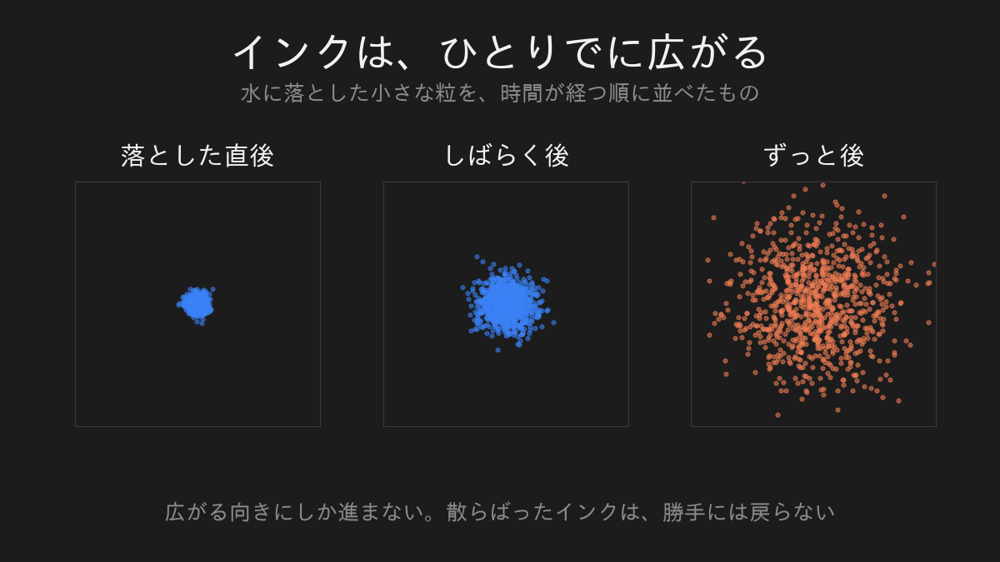
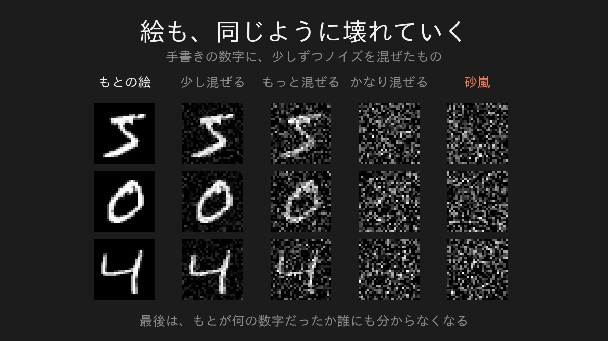
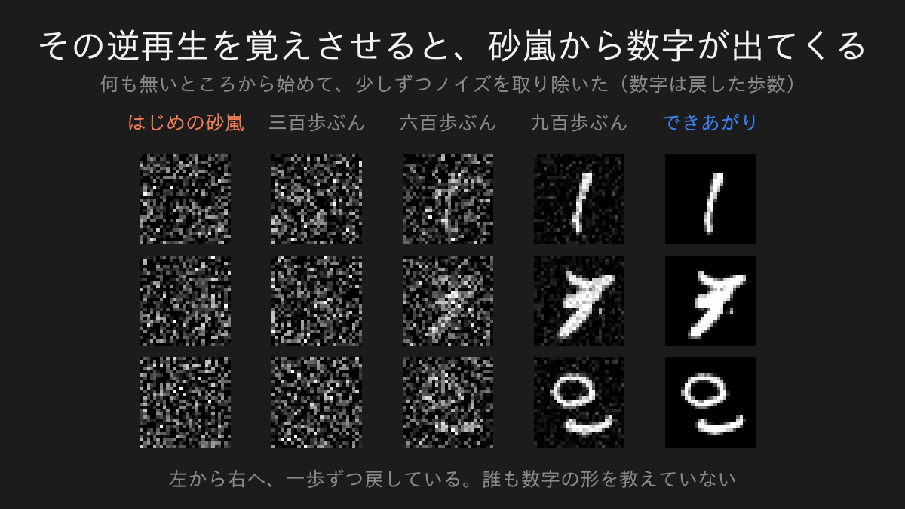
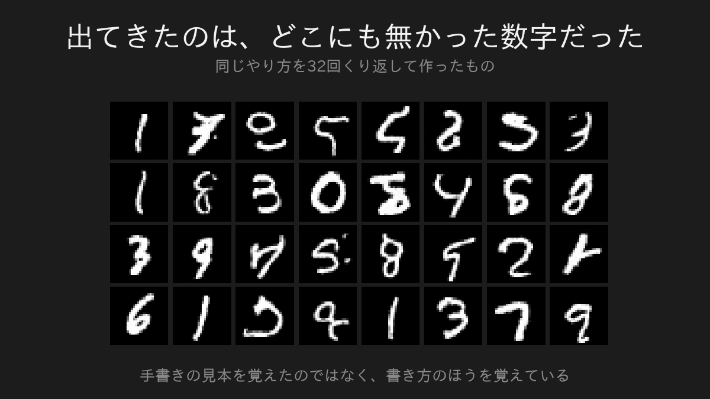

大学院にいたころ、私が長く付き合っていたのは、ものが散らばっていく話でした。

熱がじわじわ伝わる。

水に落としたインクが、ひとりでに広がる。

その「じわじわ」を式で書いて、解いて、確かめる。

そういうことをやっていました。

正直なところ、地味な話だと思っていました。

まさかこれが、AIが絵を描く仕組みそのものだとは思っていませんでした。

前回は、AIが文章のどこを見ているかを覗きました。

今回は絵にします。

## インクは、戻らない

まずインクの話を先にさせてください。

落とした直後は一か所に固まっています。

時間が経つと散らばる。

さらに経つと、どこにあったのか分からなくなる。

ここで大事なのは、この現象には向きがあることです。

広がる方には勝手に進みます。

でも、薄まったインクが勝手に集まって一滴に戻ることはありません。

放っておくと壊れる方にしか進まない。

私が院で扱っていたのは、この「壊れていく速さ」を計算する話でした。

## AIは、絵を描いていなかった

私はずっと、AIが絵を描くと聞いて、人と同じことをしているのだと思っていました。

輪郭を取って、線を引いて、色を塗る。

順番に組み立てているのだろう、と。

ぜんぶ違いました。

AIがやっていたのは、インクを広げる方でした。

## まず、絵を壊す

学習のとき、AIには手書きの数字を見せます。

そして、その絵にノイズを少しずつ混ぜていきます。

左が元の絵で、右にいくほど混ぜたノイズが増えます。

一番右まで行くと、もとが何の数字だったのか、誰にも分かりません。

砂嵐です。

ここまでは、私にもできます。

壊すだけなら誰にでもできる。

インクを広げるのと同じで、こちらの向きは簡単なんです。

## AIが覚えるのは、たった一歩ぶん

ここからが本題です。

AIに覚えさせるのは、砂嵐から絵を作る方法ではありません。

「いま見えているこの絵から、直前の一歩ぶんのノイズを取り除く」

これだけです。

千歩かけて壊したものを、一気に戻す方法は誰も知りません。

でも、一歩だけ戻すことなら、できるようになる。

なぜかというと、壊すときの答えをこちらが全部持っているからです。

どんなノイズを混ぜたかは、混ぜた本人が知っています。

だから「この汚れた絵を見せられたとき、混ざっていたノイズはこれでした」という問題と答えを、いくらでも作れる。

AIはその一問一答を延々と解かされます。

## そして、砂嵐から数字が出てくる

一歩戻せるようになったら、それを千回くり返します。

出発点は、何も無い砂嵐です。

左端はただのノイズです。

そこから一歩ずつ戻していくと、途中でぼんやりした塊が現れて、最後に数字になります。

私がこれを最初に見たとき、少し気味が悪いと思いました。

何も無いところから出てきているように見えるからです。

## 出てきた数字は、どこにも無かった数字

まとめて三十二枚作ってみました。

これは、見本の中から選んで貼り付けたものではありません。

どれも、この世に無かった数字です。

AIは手書きの見本を覚えたのではなく、「数字とはこう書かれるものだ」という書き方のほうを覚えています。

よく見ると、数字として読めないものも混ざっています。

そこは正直に載せておきます。

## 私が院で解いていた式でした

ここで、最初のインクに戻ります。

絵を壊していく計算は、水の中でインクが広がる計算と同じものでした。

似ているのではなく、同じ式です。

そして驚いたのは、逆再生のほうにも先例があったことです。

水の中で揺さぶられる粒がどう動くかを書く式は、百年以上前からあります。

その式には、粒をばらけさせる項と、粒をある方向へ引く項の両方が入っています。

AIが一歩ずつ戻すときにやっているのは、この「引く項」を推定することでした。

散らばりを戻す向きの書き方は、AIより先に物理の中にあった。

私が院で扱っていたのは、まさにそのあたりの式です。

地味だと思っていた式が、絵を作る道具になっていました。

## またあのつまみが出てきます

一つ、書いておきたいことがあります。

砂嵐から絵を戻していく途中、AIは毎回、わざと少しだけ揺らぎを足し戻しています。

きれいに戻したいなら、余計なものは足さないほうがよさそうに見えます。

でも、この足し戻しが入っているせいで、同じ砂嵐から始めても、出てくる絵は毎回ちがいます。

揺らぎを使わない作り方に変えると、こうなりません。

同じ出発点からは必ず同じ絵が出ます。

二回まわして差を測ると、ぴったり零でした。

第一回で私が気味悪がっていた「同じ質問なのに答えがちがう」は、絵のほうでも同じ形で起きていたわけです。

三回続けて、同じ性質が違う場所から出てきました。

## 正直に書いておくこと

ここで作ったのは二十八かける二十八の小さな白黒画像です。

実際の画像生成AIが作っているものとは、規模がまるで違います。

ただ、大きさが違うだけで、やっていることの骨格はここに書いた通りです。

壊す。一歩戻すことを覚える。千回くり返す。

それと、これも書いておきます。

仕組みが分かっても、AIが変な絵を出すことは無くなりません。

読めない数字が混ざるのと同じことが、大きなモデルでも起きています。

## 次に覗いてみたいもの

実は、いま話題の画像生成AIの多くは、この千回の遠回りをやめています。

まっすぐ進む方法に乗り換えました。

なぜ遠回りが要らなくなったのか。

次はその話を書きます。

---

数式とコードで、自分の手で確かめたい方へ。

同じ内容を、実際に動くコードと式で書いたものが二本あります。

[拡散モデルの中身を覗いてみる](https://zenn.dev/m2yagyu/articles/diffusion-model-toy-physics)

[拡散モデルをMNISTで動かす](https://zenn.dev/m2yagyu/articles/diffusion-model-mnist-unet)

この記事に出てきた数字の絵は、そちらのコードをそのまま実行して出したものです。
