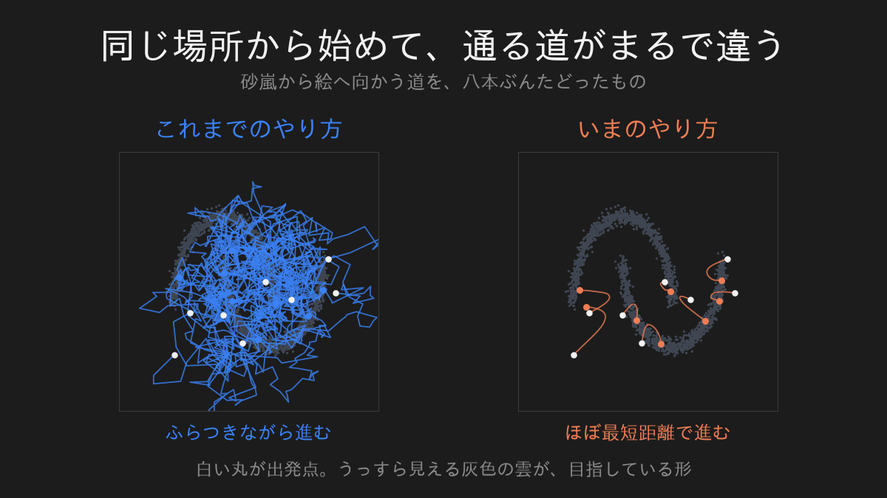
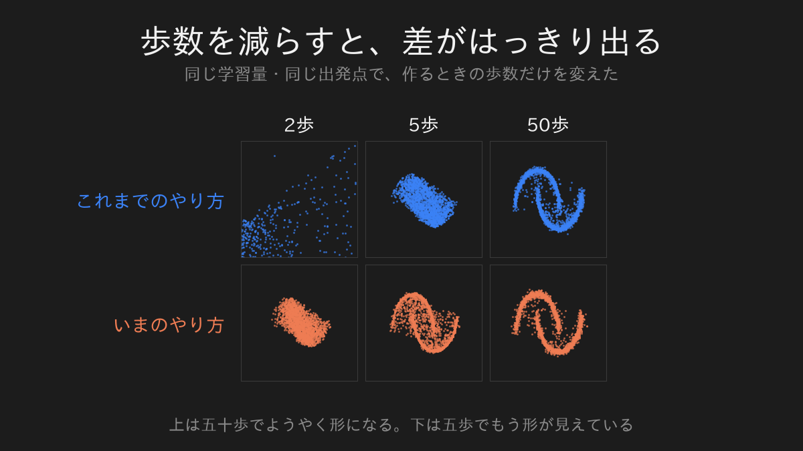
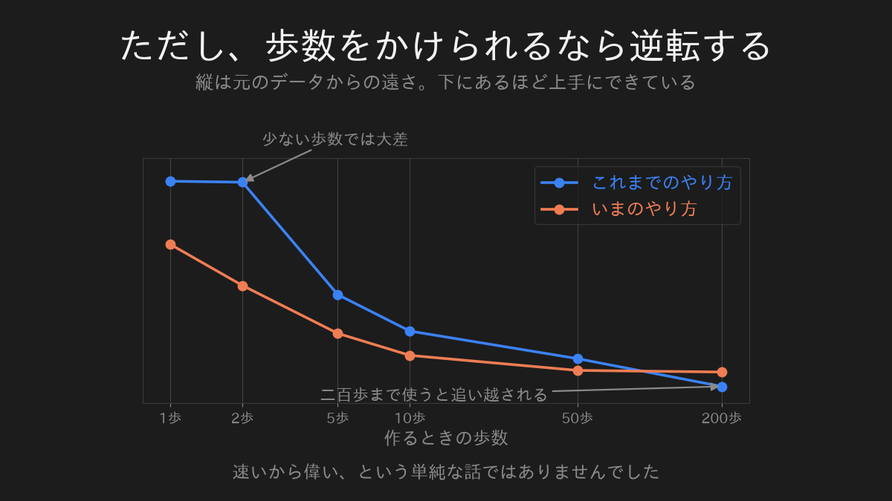
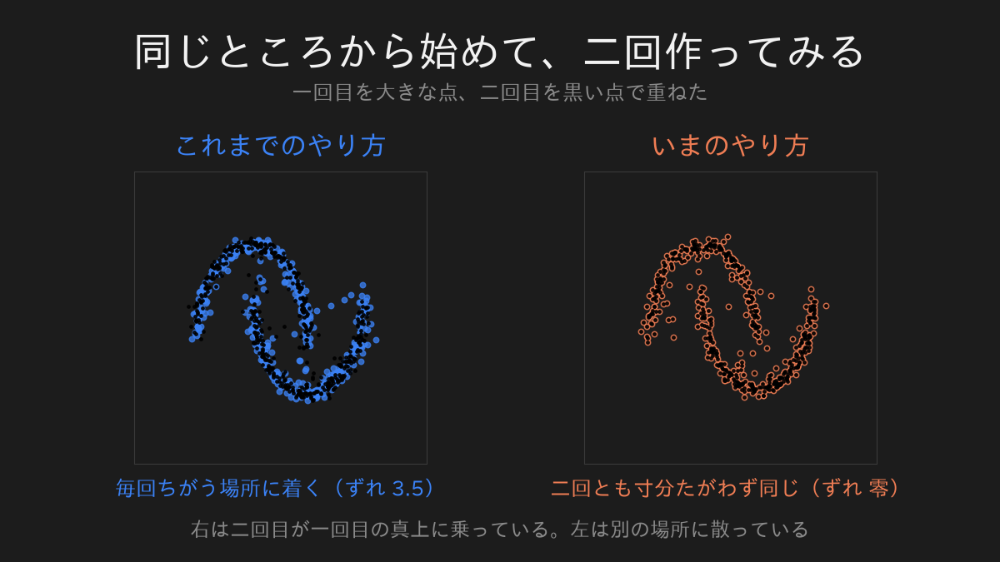

前回、AIが絵を描く仕組みを覗きました。

まず絵をノイズで壊す。

その一歩ぶんを戻すやり方を覚えさせる。

それを千回くり返すと、砂嵐から絵が出てくる。

私はこれを、うまいこと考えたものだと思いました。

ところが、その後で知りました。

いま実際に使われている画像生成AIのいくつかは、その千回をやっていません。

覚えたばかりのやり方が、もう古い側になっていました。

## 行き先は、最初から決まっていた

何が変わったのかを書きます。

前回のやり方では、絵に少しずつノイズを混ぜていきました。

千歩かけて、最後は完全な砂嵐になる。

ここで一つ、見落としていたことがあります。

**その砂嵐が、最初から決まっていた**ということです。

どんな絵から出発しても、行き着く先は同じ「ただの砂嵐」です。

途中でどれだけ丁寧に混ぜても、着く場所は変わりません。

だとしたら、と考えた人たちがいました。

行き先が決まっているなら、そこまでの道をふらふら歩く必要があるのか。

出発点と行き先を、まっすぐ線で結んではいけないのか。

## 通る道が、こんなに違う

実際に、同じ場所から出発させて、通った道を描いてみました。

左が前回のやり方です。

一歩ごとに小さな揺らぎが入るので、行ったり来たりしながら目的地に向かいます。

右が新しいやり方です。

ほとんど寄り道をしません。

同じ場所に着くのに、道のりがまるで違います。

## だから、歩数が減らせる

道がまっすぐなら、大股で歩いても目的地を外しません。

曲がりくねった道は、大股で歩くと曲がり角で外れます。

ここが効きます。

作るときの歩数を変えて、同じものを作らせました。

上の段が前のやり方、下が新しいやり方です。

新しいほうは、五歩でもう形が見えています。

前のやり方は、五十歩かけてようやく同じところに来ます。

これは電気代と待ち時間の話でもあります。

絵を一枚作るのにかかる計算は、歩数にほぼ比例します。

五歩で済むのか五十歩要るのかは、そのまま費用の桁の違いになります。

## ただし、速いから偉いわけではありません

ここは正直に書いておきます。

歩数をどんどん増やしていくと、途中で逆転します。

二百歩まで使えるなら、前のやり方のほうが上手に作れました。

新しいやり方が勝っているのは、歩数を節約したい領域だけです。

「新しいほうが性能が高い」という説明を見かけたら、少し疑ってください。

正しくは「少ない歩数で戦えるようになった」です。

私が測った範囲では、そうでした。

## 揺らぎが、消えました

もう一つ、大きな変化があります。

前のやり方は、進む途中で毎回わざと揺らぎを足していました。

新しいやり方は、それをしません。

最初に砂嵐を一回引いたら、あとは決まった道を進むだけです。

同じ砂嵐から始めれば、何度作っても寸分たがわず同じ絵が出ます。

二回作って、ずれを測りました。

前のやり方は最大で3.5ずれています。

新しいやり方はゼロでした。

丸め誤差すら出ません。

第一回で私が気味悪がっていた「同じ入力なのに答えがちがう」は、ここでは起きません。

## 四回とも、同じものに行き当たりました

ここまで、AIの中身を四回ぶん覗いてきました。

第一回は文章を書くAI、第二回は文章を読むAI、第三回と今回は絵を描くAIです。

題材はぜんぶ違います。

それなのに、毎回おなじ一点にたどり着きました。

**揺らぎをどれだけ許すか**、です。

第一回で、答えがばらついたのは、次の言葉をくじで引いていたからでした。

第二回で、記憶がぼんやり混ざったのも、同じつまみのせいでした。

第三回で、絵が毎回ちがったのも、戻る途中で揺らぎを足していたからでした。

三回とも、別々の場所を覗いたつもりが、同じつまみに当たっています。

そして今回は、そのつまみをゼロにしたらどうなるかという話でした。

ゼロにしても、絵はちゃんと出てきます。

むしろ速くなる。

長らく必要だと思われていたものが、実は無くてもよかった。

私はここに驚きました。

## なぜ最初からまっすぐにしなかったのか

当然、こういう疑問が出ます。

まっすぐでいいなら、なぜ誰も最初からそうしなかったのか。

調べてみると、詰まっていたのは道の作り方ではなく、覚えさせ方のほうでした。

まっすぐな道を教える方法が見つかっていなかった。

道を引くこと自体は、誰でも思いつきます。

それを機械に覚えさせる手立てが揃うまでに、時間がかかったということでした。

## 正直に書いておくこと

今回も、点を二千個並べただけの小さな実験です。

本物の画像生成AIの規模とは比べものになりません。

ただ、道をまっすぐにしたことと、揺らぎを外したことは、実物でも同じです。

それと、これも書いておきます。

速く絵が出るようになっても、AIが変な絵を出すことは無くなりません。

速さと正しさは、別の話です。

## 次に覗いてみたいもの

四回続けて、中身の話をしてきました。

次は、私が実際にAIに絵を描かせてみた記録を書きます。

仕組みを知ったうえで動かすと、何が見えるのか。

そこを書いてみたいと思っています。

---

数式とコードで、自分の手で確かめたい方へ。

同じ内容を、実際に動くコードと式で書いたものがこちらにあります。

[FLUXが使うフローマッチングって結局何なの？](https://zenn.dev/m2yagyu/articles/flow-matching-vs-diffusion)

この記事の図と数字は、すべてそちらのコードをそのまま実行して出したものです。
