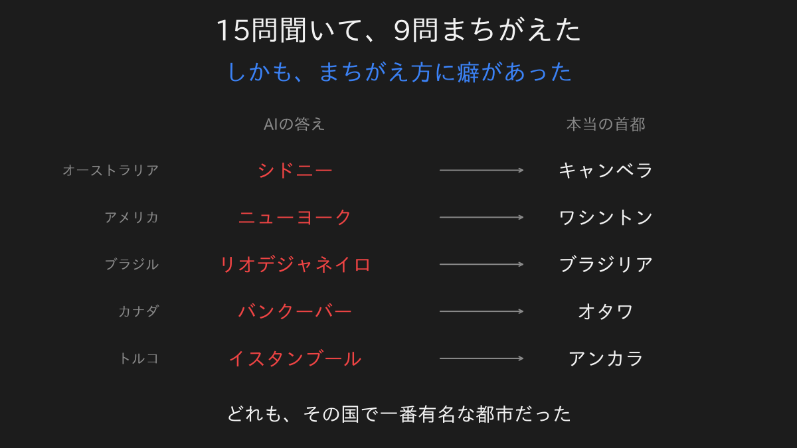
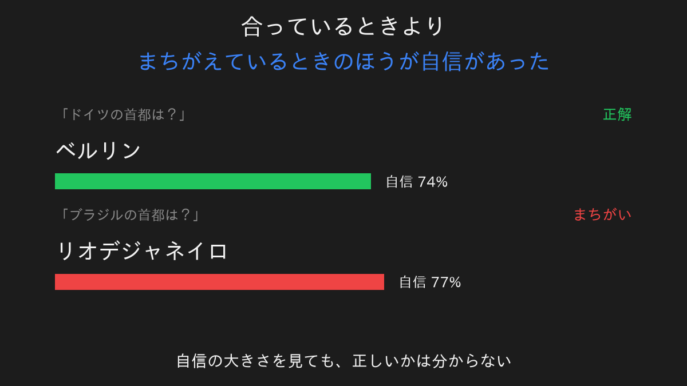
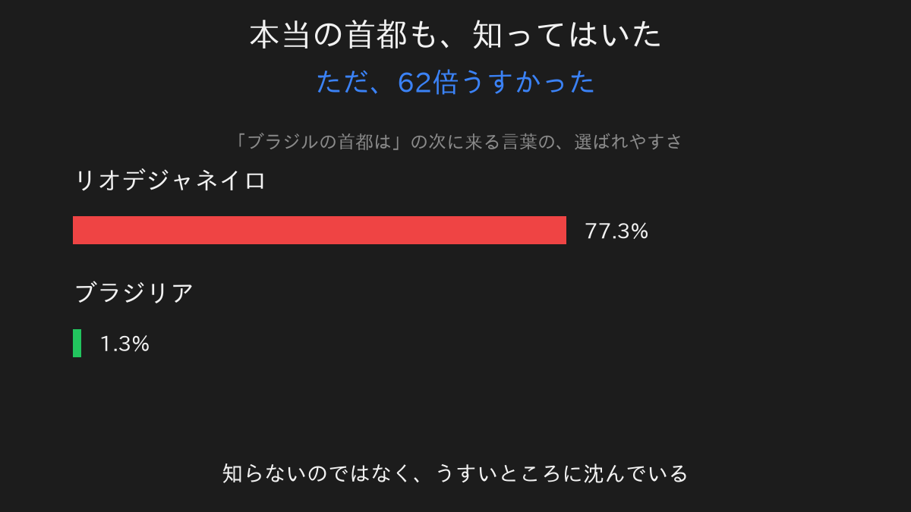
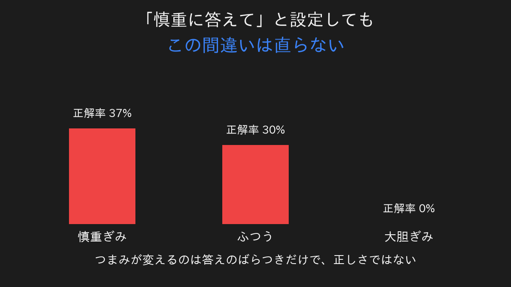

前回、AIに絵を描かせました。

出てきた絵の右下に、読めないサインが入っていました。

頼んでいないのに、そこにありました。

もっともらしい形をしているのに、中身がない。

同じことが、文章の側でも起きます。

今回はそこを見に行きます。

## 首都を15問、聞いてみた

AIに世界の首都を聞きました。

15カ国です。

正解は6問でした。

半分以上まちがえています。

ただ、正解率よりも見るべきものがありました。

**まちがえ方に、はっきりした癖がある**ことです。

シドニー。

ニューヨーク。

リオデジャネイロ。

バンクーバー。

イスタンブール。

全部ちがいます。

そして全部、その国で一番有名な都市です。

でたらめを言っているのではありません。

**その国といえば、で真っ先に出てくる名前。**

それを答えています。

## 自信のほうを見ると、逆になっていた

次に、AIがどれくらい自信を持って答えていたかを測りました。

AIは自分の答えに点数を付けています。

その点数を見れば、迷ったかどうかが分かります。

並べてみます。

ドイツの首都をベルリンと正しく答えたときの自信が、74%。

ブラジルの首都をリオデジャネイロと答えたとき。

そのときの自信が、77%。

**まちがえているときのほうが、自信が高い。**

よく言われる対処法があります。

自信のなさそうな答えを疑えばいい、というものです。

この結果を見ると、その手は使えません。

【ここにあなたの実感】

## 知らないのではなく、うすい

不思議なのは、ここからです。

AIはブラジリアを知らないわけではありません。

答えの候補には、ちゃんと入っていました。

リオデジャネイロが77.3%。

ブラジリアが1.3%。

**62倍の差があります。**

知識が無いのではありません。

正しい答えが、うすいところに沈んでいます。

なぜそうなるのか。

AIは世の中の文章を、大量に読んでいます。

そこにあった言葉の出方を、そのまま写しています。

ブラジルの話題に出てくる回数は、リオのほうが圧倒的に多い。

だからリオが濃くなり、ブラジリアがうすくなりました。

**濃さは、正しさとは関係ありません。**

## 「慎重に答えて」では直らない

では、慎重に答えるよう設定すればましになるのか。

AIには、答えのばらつき方を調整するつまみがあります。

第1回で「AIはくじを引いている」と書きました。

あのくじの偏り方を変えるつまみです。

回してみました。

慎重ぎみで37%。

ふつうで30%。

大胆ぎみで0%。

**一度も上がりません。**

つまみが変えていたのは、答えのばらつきだけでした。

慎重にすると、たしかに毎回同じ答えを返すようになります。

ただしそれは、こういうことでした。

**同じまちがいを、きっちり繰り返すようになった。**

安定したことと、賢くなったことは別です。

## 見分けられる嘘と、見分けられない嘘

よくある説明に、こういうものがあります。

AIは、知らないことを聞かれると適当を言う。

これは半分だけ当たっていました。

本当に知らないときは、実は分かります。

存在しない国の首都を聞くと、答えがばらばらになります。

自信も、はっきり落ちます。

**問題は、覚えちがいのほうです。**

覚えちがいは、正しい記憶とまったく同じ顔をしています。

自信も高く、毎回同じ答えが返り、迷った様子もありません。

外から見分ける方法がありません。

## 疑うべきなのは、自信がないときではない

というわけで、今回持ち帰ったのはこれです。

AIの答えを疑うべきなのは、

自信なさそうなときではありません。

自信たっぷりに、具体的な固有名詞を、即答してきたとき。

そこが一番あぶないところでした。

では、どうすればいいのか。

これは覚えておくと使えます。

**固有名詞、数字、日付。**

この3つが即答で返ってきたら、そこだけは自分で確かめる。

理由を聞き返しても意味がありません。

理由のほうも、もっともらしく作られるからです。

## 次に覗いてみたいもの

6回ぶん覗いてきて、だんだん分かってきたことがあります。

AIは、正しさを目指して作られていません。

**もっともらしさを目指して作られています。**

では、なぜそれで多くの場面ではちゃんと動くのか。

そこがまだ説明できていません。

次はそこを覗いてみます。

---

数式とコードで、自分の手で確かめたい方へ。

同じ内容を、実際に動くコードと式で書いたものがこちらにあります。

[ブラジルの首都をAIに聞くと、なぜ自信満々で間違えるのか](https://zenn.dev/m2yagyu/articles/llm-hallucination-confidence)

この記事の図と数字は、すべてそちらのコードをそのまま実行して出したものです。
