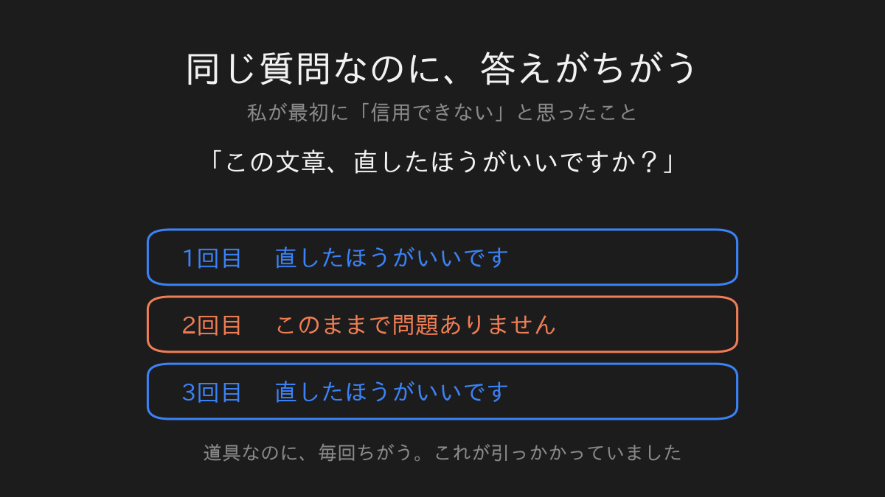
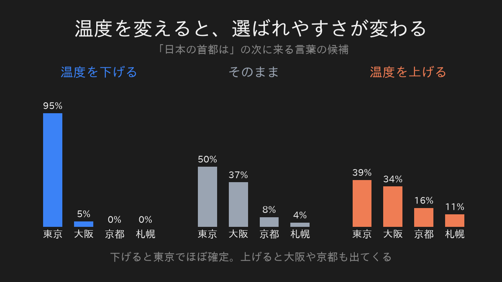
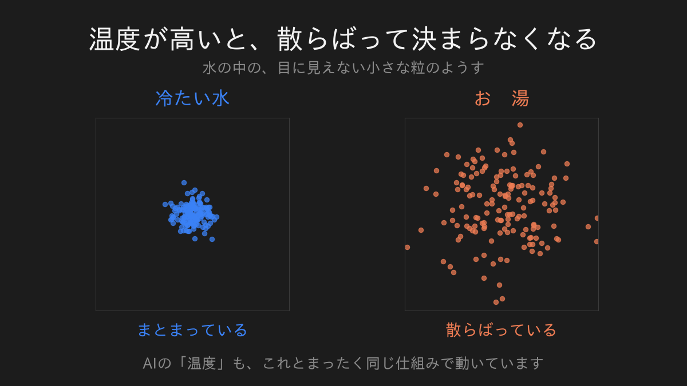

私は、生成AIをずっと疑っていました。

理由ははっきりしています。

初めて使ったとき、同じ質問を二回投げたら、結論のちがう答えが返ってきたからです。

一度目と二度目で、言っていることが食い違う。

その時点で、これは信用できない、と判断しました。

道具というのは、同じ操作をすれば同じ結果が出るものだと思っていたからです。

電卓がそうであるように。

## 仕事で使うことになった

そのあと、私はAIにコードを書かせる作業をするようになりました。

疑いは残ったままです。

ただ、使っているうちに、設定項目の中に見慣れない名前を見つけました。

`temperature`

温度、と書いてある。

なぜ温度なのか。

AIの設定に、温度という言葉が出てくる理由が分かりませんでした。

気になって、調べてみることにしました。

## 調べたら、本当に温度だった

先に結論を書きます。

あれは比喩ではありませんでした。

理系の大学院で私が習った、あの温度と同じものでした。

言葉が似ているのではなく、同じ計算をしています。

順を追って書きます。

## AIは、次の言葉をくじ引きで選んでいる

AIが文章を作るとき、やっていることは単純です。

「次に来る言葉」を、一つずつ選んでいるだけです。

たとえば「日本の首都は」という文の続きを考えるとき、AIの中では候補がこう並びます。

東京、大阪、京都、札幌。

そして、それぞれに「選ばれやすさ」がついています。

ここが大事なところです。

AIは、一番点数の高い言葉を必ず選ぶわけではありません。

くじを引いています。

だから、同じ質問でも答えが変わる。

私が最初に気持ち悪いと思ったあの現象は、これでした。

## そのくじの偏りを決めるのが温度

温度を下げると、一位の言葉がほとんど独占します。

実際に計算すると、温度を0.1まで下げたとき、「東京」が選ばれる確率は95パーセントになります。

ほぼ毎回、東京です。

温度を1.0に上げると、東京は50パーセントまで下がります。

かわりに大阪が37パーセント。

つまり、三回に一回くらいは大阪と答えます。

温度を2.0まで上げると、東京39、大阪34、京都16、札幌11。

もう、ほとんど適当です。

同じ質問なのに答えが変わる。

その理由が、この一本のつまみでした。

## 冷たい水と、お湯

なぜこれを温度と呼ぶのか。

ここで物理の話になります。

コップの水の中では、目に見えない小さな粒がずっと動き回っています。

冷たい水の中では、粒はあまり動きません。

だいたい同じところに落ち着いています。

お湯にすると、粒は激しく動き回ります。

あちこちに散らばって、どこにいるか決まらなくなる。

温度が低いと、落ち着いて、決まる。

温度が高いと、散らばって、決まらない。

AIの中で起きていることと、まったく同じです。

そして私が驚いたのは、これがたとえ話ではなかったことです。

物理で粒の散らばり方を計算する式と、AIが次の言葉を選ぶ式は、文字通り同じ形をしていました。

百五十年ほど前に作られた式が、そのまま入っていた。

だから「温度」という名前がついていたのです。

## 疑いが、理解に変わった

ここまで分かって、私の見方は変わりました。

答えがばらつくのは、AIが壊れているからではありませんでした。

ばらつくように作られている。

そして、そのばらつき具合を決めるつまみが、ちゃんと外に出ている。

不具合だと思っていたものが、設計だった。

これは、私にとって大きな違いでした。

## ただし、疑いを全部やめたわけではありません

ひとつ、正直に書いておきます。

温度は「答えがばらつく理由」の説明にはなります。

でも「答えが間違っている理由」の説明にはなりません。

ばらつくことと、間違えることは別の話です。

温度を下げても、AIは平気で嘘をつきます。

そこは疑ったままでいるのが正しいと、いまでも思っています。

## 次に覗いてみたいもの

温度がそうだったなら、他にもあるんじゃないか。

そう思って、AIの中身を順番に覗いています。

次は、AIが文章の中の「どの言葉を見ているか」を決める仕組みについて書くつもりです。

あれも、調べたら物理でした。

---

数式とコードで、自分の手で確かめたい方へ。

同じ内容を、実際に動くコードと式で書いたものがこちらにあります。

[LLMのtemperatureは本当に温度だった](https://zenn.dev/m2yagyu/articles/llm-temperature-boltzmann)

Pythonが書ける方なら、コピーするだけで同じ数字が出ます。
